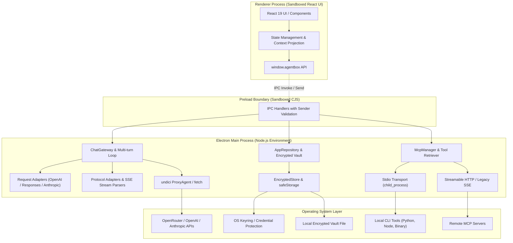

# 1. 系统架构概览

AgentBox 是一个基于 **React 19 + TypeScript + Electron 35 + electron-vite** 构建的本地 AI 智能体与多模型桌面客户端。

---

## 🏗️ 总体架构图

---

## 🔒 进程隔离与安全模型

AgentBox 严格遵循 Electron 安全最佳实践，将系统划分为相互隔离的执行环境：

### 1. 渲染进程（Renderer Process）
- **完全沙箱化**：配置 `sandbox: true`、`contextIsolation: true`、`nodeIntegration: false` 和 `webSecurity: true`。
- **无敏感数据访问权**：渲染进程永远无法获取 API Key 明文或 Vault 主密钥。所有供应商配置在传递给前端时，API Key 均被脱敏（仅暴露布尔值 `hasApiKey`）。
- **CSP 策略**：生产环境下以 `file://` 协议加载，严格的内容安全策略（Content Security Policy）嵌入在 `index.html` meta 标签中。

### 2. Preload 边界（Preload Bridge）
- **最小化白名单暴露**：仅通过 `contextBridge.exposeInMainWorld('agentbox', api)` 暴露经过 `deepFreeze` 冻结的 API 对象。
- **构建输出规范**：由于开启了沙箱模式，preload 脚本必须打包输出为标准的 CommonJS 单文件（`out/preload/index.cjs`），避免任何顶层 ESM 导入或动态模块加载故障。

### 3. 主进程（Main Process）
- **IPC 严格验证**：所有 IPC 处理函数（`ipcMain.handle`）均严格校验调用方的 `event.senderFrame === mainWindow.webContents.mainFrame` 与页面 URL。
- **统一发起网络与系统调用**：所有 API 请求、代理转发、加解密存储和子进程创建（Stdio MCP）均在主进程执行。
- **窗口与外链生命周期**：阻止任何未授权的新建窗口行为（`setWindowOpenHandler`），所有外部 HTTP/HTTPS 链接必须通过主进程的二次协议与主机名校验后才交由 `shell.openExternal` 唤起系统浏览器。

---

## 📡 IPC 接口通道一览

IPC 通道常量集中定义于 [`src/shared/ipc.ts`](../src/shared/ipc.ts)：

| 通道名称 | 用途 | 传输数据 |
| --- | --- | --- |
| `chat:stream` | 发起会话流式请求 | `ChatRequest` -> 返回 `{ requestId }` |
| `chat:stop` | 终止进行中的会话生成 | `conversationId` |
| `chat:event` (Event) | 主进程向渲染进程推送流事件 | `StreamEvent` (增量文本, 思考, 工具调用, 结果等) |
| `vault:bootstrap` | 初始化并加载 Vault 状态 | 返回全部脱敏配置、模型、供应商、技能与 MCP 服务 |
| `vault:saveSettings` | 保存用户偏好与供应商密钥 | `SettingsSavePayload` |
| `vault:clearConversations` | 清除全部历史会话并重新加密 | - |
| `data:export-backup` | 选择目标路径并导出浅/深会话 ZIP 备份 | `ExportBackupInput` -> `ExportBackupResult` |
| `skills:*` | 技能 CRUD、开关与重置 | 技能输入定义、ID、开关状态 |
| `mcp:*` | MCP 服务 CRUD、连通性测试与工具查询 | 服务定义、测试输入、工具列表 |
