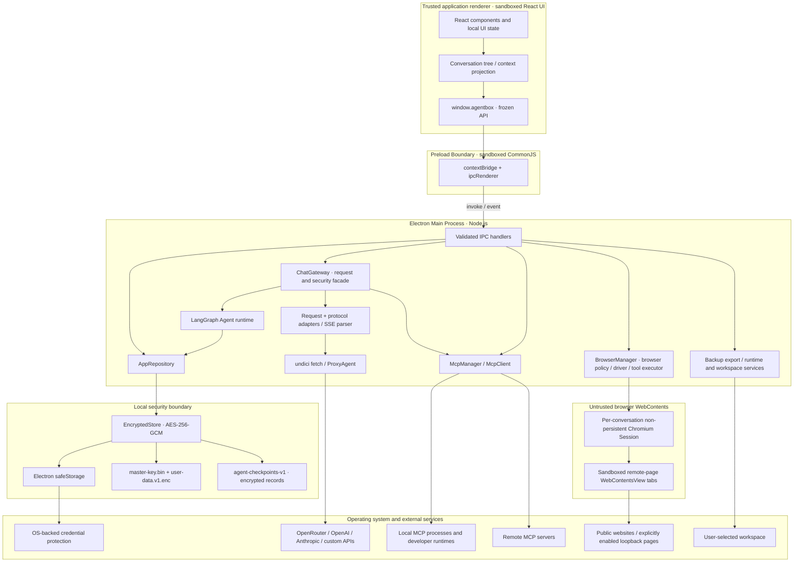

# 1. System Architecture Overview

> 中文：[系统架构概览](../docs_zh/architecture.md)

AgentBox is a local-first desktop agent and multi-model AI client. The current project is built with **React 19, TypeScript 5.7, Electron 35, Vite 5.4, and electron-vite 3**. See [`package.json`](../package.json) for the authoritative version ranges.

---

## 🏗️ High-level architecture

The trusted application renderer is responsible only for presentation and interaction. Persistence, provider requests, MCP connections, terminal and runtime detection, workspace file access, and backup export all run in the privileged main process. Preload is the application's only public bridge between those two application processes. Optional remote browser pages are separate sandboxed Chromium WebContents managed by the main process; they make Chromium network requests through their own session and never receive the application preload or IPC.

---

## 🔒 Process isolation and security boundaries

### 1. Renderer process

- **Electron sandbox:** The window enables `sandbox: true`, `contextIsolation: true`, `nodeIntegration: false`, `webSecurity: true`, and `allowRunningInsecureContent: false`.
- **No Node.js or direct network access:** The trusted application renderer's production CSP uses `connect-src 'none'` and disables objects, frames, workers, media, manifests, and form submission. While the development server is running, a build plugin additionally permits same-origin connections and WebSockets. This rule does not describe the separate untrusted browser WebContents, whose Chromium requests are controlled by `BrowserManager` session policy.
- **Minimal exposure of secrets:** Provider lists use `ProviderView` and return `hasApiKey`, never the API key itself. MCP environment variables and headers, and proxy URLs containing credentials, are masked before they are returned to the renderer. The Vault key never crosses IPC.

The relevant controls live in [`src/electron/main.ts`](../src/electron/main.ts), [`src/renderer/index.html`](../src/renderer/index.html), and [`electron.vite.config.ts`](../electron.vite.config.ts).

### 2. Preload boundary

- [`src/electron/preload.ts`](../src/electron/preload.ts) exposes only a domain-specific API through `contextBridge.exposeInMainWorld('agentbox', ...)` and recursively freezes the public object.
- The renderer can invoke only the predefined `ipcRenderer.invoke` channels and has two typed event subscriptions: `chat:event` for normalized model/tool stream events and `browser:event` for sanitized browser state or download metadata. It does not receive generic IPC, filesystem, or process APIs.
- The sandboxed preload is emitted as the single CommonJS file `out/preload/index.cjs`. The main process is also emitted as `out/main/index.cjs` so CommonJS dependencies continue to resolve correctly from a packaged ASAR.

### 3. Main process

- **Uniform IPC validation:** The registration helper in [`src/electron/ipc/register-ipc.ts`](../src/electron/ipc/register-ipc.ts) checks the `webContents.id`, top-level `senderFrame`, and the exact production `file:` page or development-server origin and path for every invoke. Child frames and unknown pages are rejected.
- **Permissions denied by default:** Both permission requests and permission checks on the default session are denied.
- **Renderer navigation is blocked:** `will-navigate` prevents navigation away from the current page, and `setWindowOpenHandler` always denies new windows. Only syntactically valid `http:` or `https:` URLs without embedded usernames or passwords are passed to `shell.openExternal`. There is no hostname allowlist.
- **Single instance and cleanup:** The application holds a single-instance lock. Closing a window cancels active generation, resolves pending tool approvals as denied, and closes MCP clients; quitting also destroys the in-memory Vault state and key.
- **Isolated multi-tab browser:** The optional built-in browser is owned by `BrowserManager` in the main process. Sessions are created on demand; a new session, a user-created tab, and the replacement for the final closed tab navigate to the validated `AppSettings.browserHomePage`, which defaults to Google. AgentBox keeps at most three live sessions and one visible session, with up to twelve sandboxed `WebContentsView` tabs per session. Opening a fourth session closes the least-recently-used hidden session. Remote pages have no preload, Node.js, AgentBox IPC, DevTools, or granted web permissions. New windows become policy-checked tabs. Browser views are hidden while Settings or the New conversation dialog is open and are destroyed when their conversation is deleted, the window closes, or the application exits. Chromium session traffic follows the custom proxy through `Session.setProxy`; provider/MCP `undici.ProxyAgent` dispatch remains separate. Downloads, uploads, screenshots, loopback HTTP, and Cookie persistence are independent explicit settings.

---

## 📡 IPC contract

Channel constants are centralized in [`src/shared/ipc.ts`](../src/shared/ipc.ts). The public methods and their types are defined in [`src/electron/preload.ts`](../src/electron/preload.ts) and [`src/shared/types.ts`](../src/shared/types.ts). The legacy `vault:*` and `chat:stream` channels no longer exist.

| Domain                | Channels                                                                                                                                                                          | Purpose                                                                                                                                                                                                                                                                                                                                                                                                  |
| --------------------- | --------------------------------------------------------------------------------------------------------------------------------------------------------------------------------- | -------------------------------------------------------------------------------------------------------------------------------------------------------------------------------------------------------------------------------------------------------------------------------------------------------------------------------------------------------------------------------------------------------- |
| Settings              | `settings:get`, `settings:update`                                                                                                                                                 | Read or update application settings; mask proxy credentials on output                                                                                                                                                                                                                                                                                                                                    |
| Providers             | `providers:list`, `providers:upsert`, `providers:remove`, `providers:test`                                                                                                        | Manage connections, write API keys, and test the models endpoint                                                                                                                                                                                                                                                                                                                                         |
| Models                | `models:list`, `models:upsert`, `models:remove`, `models:discover`                                                                                                                | Manage local model configurations and discover remote models                                                                                                                                                                                                                                                                                                                                             |
| Skills                | `skills:list`, `skills:upsert`, `skills:remove`, `skills:toggle`, `skills:reset-defaults`                                                                                         | Manage skill packages, enablement, and built-in skill reset                                                                                                                                                                                                                                                                                                                                              |
| MCP                   | `mcp:list-servers`, `mcp:upsert-server`, `mcp:remove-server`, `mcp:toggle-server`, `mcp:test-server`, `mcp:list-tools`                                                            | Manage MCP servers, test connections, and query tools                                                                                                                                                                                                                                                                                                                                                    |
| Terminal and runtimes | `terminal:test-shell`, `runtime:test`, `runtime:list-conda-environments`                                                                                                          | Test the integrated shell and developer runtimes, and list Conda environments                                                                                                                                                                                                                                                                                                                            |
| Workspace             | `workspace:get-default-directory`, `workspace:select-directory`                                                                                                                   | Ensure and return the application-adjacent default workspace, or open the system directory picker and return a normalized absolute path                                                                                                                                                                                                                                                                  |
| Conversations         | `conversations:list`, `conversations:get`, `conversations:save`, `conversations:remove`                                                                                           | Read and persist conversation trees                                                                                                                                                                                                                                                                                                                                                                      |
| Data                  | `data:export-backup`, `data:clear-conversations`                                                                                                                                  | Export a shallow or deep ZIP backup, or clear all conversations                                                                                                                                                                                                                                                                                                                                          |
| Chat                  | `chat:start`, `chat:cancel`, `chat:resolve-tool-approval`                                                                                                                         | Start a request, cancel it by `requestId`, and resolve tool approval                                                                                                                                                                                                                                                                                                                                     |
| Stream events         | `chat:event`                                                                                                                                                                      | Push `StreamEvent` values to the renderer: text, reasoning, citations, tools, usage, completion, or errors                                                                                                                                                                                                                                                                                               |
| Browser               | `browser:ensure`, `browser:navigate`, `browser:command`, `browser:new-tab`, `browser:switch-tab`, `browser:close-tab`, `browser:set-view-state`, `browser:close`, `browser:event` | Control user-visible tabs and publish sanitized `BrowserState` metadata (`activeTabId`, tab `id`) or download name/progress metadata; Cookie profiles/values, absolute browser paths, DOM state, origin grants, and live page storage remain main-process internal. Approved Agent snapshots and screenshot bytes travel separately as `chat:event` tool results and become encrypted conversation data. |
| Application           | `app:get-info`                                                                                                                                                                    | Return the application name, version, and platform                                                                                                                                                                                                                                                                                                                                                       |

`chat:start` returns a newly generated `{ requestId }`. Cancellation, tool approval, and stream events are all associated with this request ID; a conversation ID does not directly control an in-flight generation.

---

## 🔗 Key implementation files

- [`src/electron/main.ts`](../src/electron/main.ts): window security, application lifecycle, and service composition
- [`src/electron/preload.ts`](../src/electron/preload.ts): renderer-facing API
- [`src/electron/ipc/register-ipc.ts`](../src/electron/ipc/register-ipc.ts): IPC registration, input boundaries, and trusted-sender checks
- [`src/electron/api/gateway.ts`](../src/electron/api/gateway.ts): request orchestration, stream handling, and the Agent tool loop
- [`src/electron/api/agent-runtime.ts`](../src/electron/api/agent-runtime.ts): provider-neutral LangGraph state machine for model, tool, and terminal turns
- [`src/electron/browser/browser-manager.ts`](../src/electron/browser/browser-manager.ts): isolated browser sessions, tab/view lifecycle, Chromium proxy/session policy, downloads, and Cookie snapshots
- [`src/electron/browser/browser-policy.ts`](../src/electron/browser/browser-policy.ts): public-destination, loopback, private-network, credential, and URL-redaction policy
- [`src/electron/browser/browser-driver.ts`](../src/electron/browser/browser-driver.ts): isolated-world DOM snapshots/interactions and controlled file-input operations
- [`src/electron/browser/browser-tool-executor.ts`](../src/electron/browser/browser-tool-executor.ts): parameter-aware browser approvals, origin grants, and Gateway dispatch
- [`src/renderer/src/components/browser/BrowserPanel.tsx`](../src/renderer/src/components/browser/BrowserPanel.tsx): tab controls and typed native-view bounds reporting
- [`src/electron/storage/agentbox-checkpoint-saver.ts`](../src/electron/storage/agentbox-checkpoint-saver.ts): encrypted `BaseCheckpointSaver` adapter and message snapshot/delta reconstruction
- [`src/electron/storage/checkpoint-repository.ts`](../src/electron/storage/checkpoint-repository.ts): checkpoint quotas, manifests, lifecycle deletion, and recovery
- [`src/electron/storage/app-repository.ts`](../src/electron/storage/app-repository.ts): Vault domain repository and schema validation
- [`src/electron/mcp/mcp-manager.ts`](../src/electron/mcp/mcp-manager.ts): MCP client lifecycle and proxy dispatch
