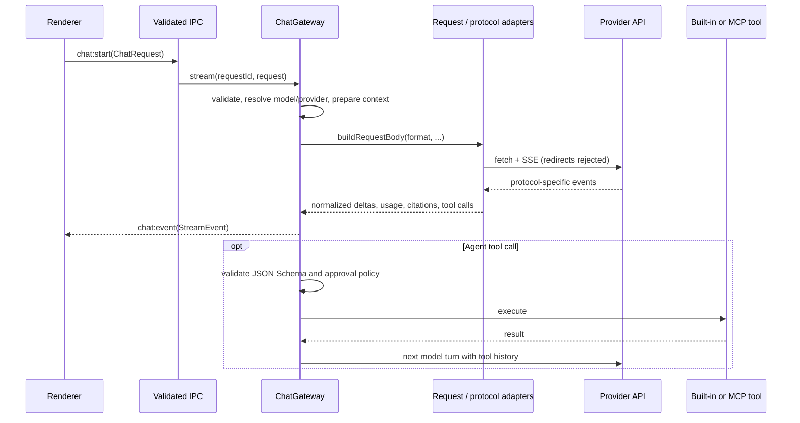

# 3. API Protocols and Request Gateway

> 中文：[API 协议与请求网关](../docs_zh/gateway-and-protocols.md)

[`ChatGateway`](../src/electron/api/gateway.ts) is the main-process request and security facade between the renderer and model providers. It validates requests, resolves the model and provider, prepares context, builds protocol-specific requests, consumes SSE, and normalizes stream events. In Agent mode it supplies provider and secure-tool callbacks to the provider-neutral LangGraph state machine in [`agent-runtime.ts`](../src/electron/api/agent-runtime.ts).

The graph state and transition contract are documented in [LangGraph Agent Runtime](./langgraph-agent-runtime.md).

---

## 🔄 Request lifecycle



`chat:start` immediately returns a `requestId`, while generation continues asynchronously. Text, reasoning, citations, tool state, usage, completion, and errors are pushed through `chat:event`. `chat:cancel` and tool approvals are associated with the same `requestId`.

---

## 🌐 Three API formats

`ModelConfig.apiFormat` can override the provider's default format. The endpoint is formed from the normalized base URL and one of these relative paths:

| API format                      | Endpoint           | Main request structure                                                    | Main streaming events                                                                                                   |
| ------------------------------- | ------------------ | ------------------------------------------------------------------------- | ----------------------------------------------------------------------------------------------------------------------- |
| **OpenAI Chat Completions API** | `chat/completions` | `messages`, `tools`, `max_tokens`, `reasoning` / `reasoning_effort`       | `choices[].delta.content`, `delta.tool_calls`, `reasoning*`, `usage`                                                    |
| **OpenAI Responses API**        | `responses`        | `instructions`, `input`, function tools, `max_output_tokens`, `reasoning` | `response.output_text.delta`, `response.function_call_arguments.delta`, `response.reasoning*`, terminal response events |
| **Anthropic Messages API**      | `messages`         | `system`, content-block `messages`, `tools`, `thinking`, `max_tokens`     | `content_block_start/delta`, `text_delta`, `thinking_delta`, `signature_delta`, `input_json_delta`                      |

The adapters are implemented in [`request-adapters.ts`](../src/electron/api/request-adapters.ts) and [`protocol-adapters.ts`](../src/electron/api/protocol-adapters.ts). Shared history is reconstructed into each protocol's assistant tool-call and tool-result representation. Completed Responses reasoning items and Anthropic thinking signatures are retained in the Agent trace so protocol state can be replayed in later turns and after interruption recovery.

### Attachment conversion

- Chat Completions converts images to `image_url` content parts and inlines text attachments. A PDF or other document is represented only by an attachment placeholder in this format.
- The Responses API uses `input_image` and `input_text`; documents currently use a text placeholder here as well.
- The Anthropic Messages API converts images to Base64 image blocks and PDFs to document blocks. Other text files are inlined as text blocks.

Consequently, an attachment being stored in a conversation does not imply that every remote protocol can receive that attachment format natively.

---

## 🧠 Reasoning and thinking normalization

On the request side, fields differ by provider and protocol:

- **OpenRouter:** Chat Completions and Responses use a `reasoning` object. When enabled, AgentBox sends `enabled`, `effort`, and `exclude: false`; when disabled, it sends `effort: "none"`.
- **OpenAI-compatible providers and CLIProxyAPI:** Chat Completions uses `reasoning_effort` according to the connection type, while Responses uses `reasoning`. A regular OpenAI or custom connection generally omits the field when reasoning is disabled; CLIProxyAPI sends an explicit `none` value.
- **Anthropic:** Disabled thinking uses `{ type: "disabled" }`. The default adaptive thinking mode uses `{ type: "adaptive" }` with `output_config.effort`. Manual extended thinking uses `{ type: "enabled", budget_tokens }`; the budget is derived from reasoning effort and maximum output length, which must exceed 1,024 tokens.

On the response side, the gateway normalizes data into `reasoning-delta` events and `TokenUsage.reasoningTokens`:

1. Chat Completions reads `delta.reasoning`, `delta.reasoning_content`, and OpenRouter `reasoning_details` entries of type `reasoning.text` or `reasoning.summary`.
2. OpenRouter normalizes some native Gemini `thoughtsTokenCount` values to `completion_tokens_details.reasoning_tokens`. AgentBox reads that normalized field; it does not parse `thoughtsTokenCount` directly.
3. The Responses API adapter reads textual `response.reasoning*` delta events and retains completed reasoning output items for protocol replay.
4. The Anthropic adapter reads thinking and signature deltas, accumulates them by content block, and persists the signatures.
5. If a provider reports reasoning-token usage without visible text, the UI displays the token count and states that the model returned no visible reasoning. This does not mean the application has access to a hidden chain of thought.

---

## 📊 Token usage normalization

Provider usage is normalized into input, output, reasoning, cached-input, cache-write, web-search, and total counters. Chat Completions reads cached prompt details and Responses reads `input_tokens_details`; in both OpenAI formats, cached input is already a subset of input. Anthropic's `input_tokens` is instead an uncached base, so its normalized input adds `cache_read_input_tokens` and `cache_creation_input_tokens` while retaining both cache counters as a separate breakdown.

Usage can arrive in several events during one provider request—for example, Anthropic reports input/cache values at `message_start` and output values later. Every normalized usage event carries its one-based model turn. The renderer merges fields from the same turn, preserves the resulting per-request breakdown in `TokenUsage.modelRequests`, and recomputes message-level totals across every Agent model request. Cached-input and cache-write values remain separate observability counters and are not added again to `totalTokens`; when a provider omits a total, the client derives it from input plus output only.

---

## ♻️ Provider context reuse and fallback

**Settings → General → Agent token optimization → Provider context reuse** is disabled by default. It supports four modes: `off`, `auto`, `prefix-cache`, and `native-continuation`.

- Prefix caching sends a deterministic SHA-256 cache key with OpenAI Chat Completions or Responses requests. Anthropic-format requests mark the stable system-instruction block with ephemeral `cache_control`. The local conversation, provider, and model IDs are hashed rather than sent as cache-key plaintext.
- Native continuation applies to the Responses format. The first response opts into provider-side state with `store: true`; later model turns send `previous_response_id`, current instructions/tools, and only the new user items or function-call outputs after the saved response. The validated opaque response handle is persisted in the encrypted conversation message so the next user turn can continue the chain.
- `auto` prefers native continuation only for a direct OpenAI Responses connection, uses prefix caching for known OpenAI/Anthropic/OpenRouter paths, and leaves unknown custom/CLIProxyAPI capabilities stateless. Explicit modes may optimistically try a compatible wire shape on custom endpoints.
- A strategy-specific HTTP compatibility rejection (`400`, `404`, `409`, or `422`) disables that strategy for the rest of the current Agent request and retries before any local tool execution. The fixed downgrade order is native continuation → prefix caching → the existing stateless full replay. Rate limits, authentication failures, server errors, and unrelated validation errors are never hidden by fallback.

Native continuation can retain provider-side application state according to the provider account and data-retention policy. OpenAI Responses instructions are resent because `previous_response_id` does not carry previous instructions forward. Zero Data Retention may force `store` off; an incompatibility response then follows the same safe downgrade chain.

---

## 🔍 OpenRouter web search

Web search is available only for OpenRouter connections and can be attached to all three API formats. The request adapter adds the `openrouter:web_search` server tool:

```json
{
  "type": "openrouter:web_search",
  "parameters": {
    "engine": "auto | native",
    "max_results": 5,
    "max_uses": 2,
    "max_total_results": 8
  }
}
```

- `off` omits the search tool. `auto` and `native` are passed through to OpenRouter as the `engine`; AgentBox neither performs local search nor decides provider fallback itself.
- Enabling search also sets `max_tool_calls: 2`. This is a limit sent with the complete provider request, not a renderer-side display counter.
- Protocol adapters extract sources from Chat Completions annotations, Responses output and content annotations, and Anthropic citation fields. Only HTTP(S) URLs without embedded credentials are accepted.
- Later events for the same URL may add a title, excerpt, or character range. Stream state deduplicates these updates and permits at most 100 unique URLs per message and 300 citation variants per stream. The UI renders citation cards and the provider-reported `webSearchRequests` count.

---

## 🛠️ Multi-turn Agent tool loop

Tool calls are executed only in Agent mode. The gateway combines two categories of tools:

- External tools exposed by enabled MCP servers. In `auto` retrieval mode, BM25 selects at most eight tools relevant to the current request. The `all` mode includes every discovered tool.
- Built-in AgentBox tools: the skill loader, integrated terminal, workspace file read and write tools when a working directory is present, a JavaScript/Python code runner only when at least one enabled skill contains a Python file, and the optional isolated browser family when both browser opt-ins are enabled.

Model-supplied arguments must be a JSON object and pass the tool's JSON Schema through AJV. With the exception of the local read-only skill loader, approval is determined by the selected policy plus tool annotations or the built-in tool's risk definition. `always` prompts for every applicable call; `sensitive` automatically permits only tools explicitly declared read-only, non-destructive, and closed-world; `full-access` does not prompt. Approval can time out after five minutes or wait until the user decides or cancels.

Browser tools add parameter-aware approval and stable tab targeting. The tab-management result enumerates every `tab_id`; later calls default to the active tab but may name another. A user may grant page-reading/screenshot access to one origin for the current in-memory browser session, but this never grants click, type, upload, or download permission. Navigation arguments are persisted only after sensitive URL query keys are redacted. Semantic snapshots are bounded untrusted text and screenshots are bounded JPEG tool content. Every interaction invalidates that tab's references. Responses and Anthropic carry screenshot content inside the tool result; Chat Completions receives the required text-only tool message followed by a labeled untrusted user-image message.

Each tool result is converted back into the active provider protocol for the next model turn, while `toolExecutions` and `agentTrace` are recorded. The tool-turn limit defaults to 30 and can be configured from 1 to 100. Once reached, new calls are not executed. The context budget first subtracts estimated tool-definition tokens, then retains or trims complete conversation turns according to manual or automatic context management. Automatic mode never removes system messages or the latest user turn.

Four independent Agent token optimizations are available and are disabled by default for compatibility. Tool-result compaction keeps the complete result in renderer events and local conversation persistence, but replaces the model replay with a deterministic head/tail preview (16,000 characters by default, configurable from 2,000 to 100,000) whose marker retains the `call_id`; the read-only `agentbox_read_tool_result` tool can retrieve the complete text in chunks. Dynamic tool exposure ranks the combined authorized built-in/MCP catalog, initially mounts at most four tools by default (configurable from 1 to 16), and always retains `agentbox_search_tools` so matching authorized tools can be mounted for the next model turn. Lazy Skill resources and in-run context compaction are described in their respective module documents.

In-run context compaction activates at a configurable soft threshold (70% by default, range 50–95%). It removes only whole, complete older tool-turn messages created after the current user message, replaces them with a deterministic summary, and preserves the most recent three tool turns by default (configurable from 1 to 10). Incomplete calls and recent protocol call/result pairs are never split.

The `model -> tools -> model -> terminal` transitions are executed by a request-scoped LangGraph `StateGraph`. Provider requests, SSE parsing, approvals, tool execution, and `StreamEvent` emission remain in the Gateway callbacks, so the graph cannot bypass existing protocol or security boundaries. Agent requests with a response message ID use an encrypted `BaseCheckpointSaver` sidecar. Safe provider-node failures resume from that graph thread; missing, stale, cancelled, tool-limit, and uncertain side-effect states use `agentTrace` fallback instead. No plaintext graph database is created.

---

## 🛡️ Network, proxy, and error boundaries

### URLs and authentication

- Provider and remote MCP base URLs may use only `http:` or `https:`. A non-loopback host must use HTTPS; HTTP is limited to `localhost`, `::1`, and `127.0.0.0/8`. Usernames, passwords, query strings, and fragments are removed when the URL is stored.
- Direct Anthropic-style connections use `x-api-key` for the Anthropic Messages API. The same format through OpenRouter uses a Bearer token. Other API formats use Bearer tokens. A CLIProxyAPI connection on a loopback address may omit the API key.
- Provider generation and model-discovery requests use `redirect: "error"`, so they do not automatically follow a redirect to another address.

### Global proxy

Under **Settings → General → Network proxy**, `off` connects directly. In `custom` mode, the gateway and remote MCP manager each cache an `undici.ProxyAgent`. A configuration change closes the previous dispatcher and creates a new one on the next request.

- A loopback proxy may use HTTP; a remote proxy must use HTTPS.
- A proxy URL may carry a username and password in its userinfo. Settings IPC replaces them with `***` on output, and saving that unchanged masked URL retains the original credentials.
- Before returning a gateway error to the UI, AgentBox replaces the provider API key and the proxy username and password. Ordinary error text must never be used to diagnose or echo secret values.

### Limits and timeouts

- An active response stream is aborted after 120 seconds without network data. Tool approval uses its own five-minute or indefinite wait and is not subject to this watchdog.
- Model discovery has a 30-second timeout and a 32 MiB response-body limit. At most 32 KiB of an error response is read.
- A single SSE event or an unterminated data line is limited to 5,242,880 characters. Exceeding the limit stops parsing so an untrusted provider response cannot consume memory without bound.

The main security paths are implemented in [`provider-policy.ts`](../src/electron/api/provider-policy.ts), [`sse.ts`](../src/electron/api/sse.ts), [`tool-policy.ts`](../src/electron/mcp/tool-policy.ts), and [`context-window.ts`](../src/electron/api/context-window.ts).
