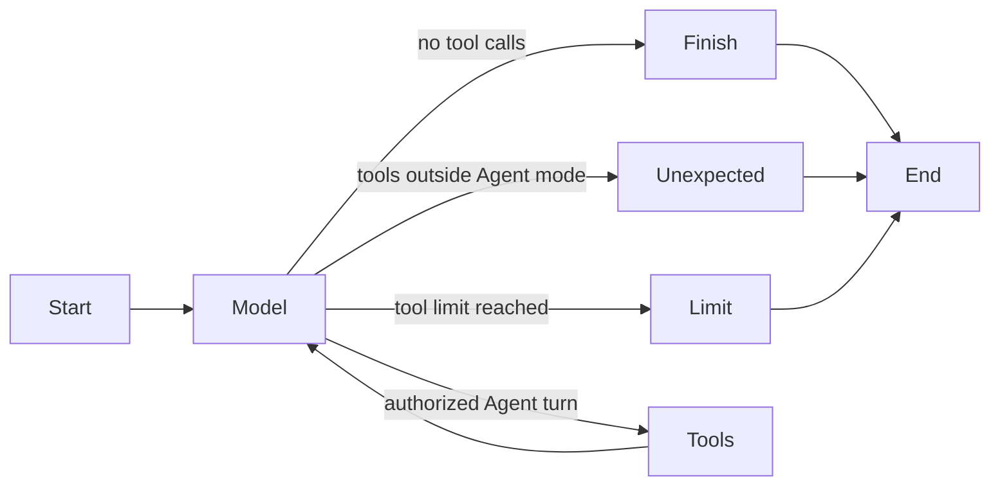

# LangGraph Agent Runtime Refactor

> 中文：[LangGraph Agent Runtime 重构设计](../docs_zh/langgraph-agent-runtime-design.md)

Status: phase one implemented and verified.

## Objective

Move the multi-turn Agent state machine out of `ChatGateway` and into a small LangGraph runtime while preserving AgentBox's existing provider protocols, stream-event contract, tool security policy, encrypted storage boundary, and Electron process isolation.

This refactor is intended to make the `model -> tools -> model -> terminal` lifecycle explicit and independently testable. It is not a migration of the complete application to LangChain abstractions.

## Scope

The first implementation phase introduces `@langchain/langgraph` and `@langchain/core` only for Agent control flow.

In scope:

- model-turn and tool-turn graph transitions;
- Agent tool-turn accounting and termination;
- propagation of the existing cancellation signal into graph execution;
- contract tests for normal completion, repeated tool turns, disabled Agent mode, tool-turn limits, and failures;
- an adapter boundary that lets `ChatGateway` continue emitting the existing `StreamEvent` values.

Out of scope:

- replacing the raw OpenAI Chat Completions API, OpenAI Responses API, or Anthropic Messages API adapters;
- replacing the official MCP TypeScript SDK client or `McpManager`;
- allowing LangGraph or LangChain tools to bypass AJV validation, approval policy, workspace restrictions, timeouts, or result limits;
- adding LangSmith or any default remote tracing;
- storing graph checkpoints in an unencrypted SQLite database;
- changing renderer, preload, or IPC contracts.

## Target boundary

```text
Renderer / validated IPC
            |
        ChatGateway
            |
     LangGraph runtime
       /          \
model-turn hook  tool-turn hook
       |              |
raw protocol      existing validation,
adapters + SSE    approval and executors
       \              /
        existing StreamEvent emitter
```

`ChatGateway` remains the request-scoped composition root. It owns provider and model resolution, proxy dispatch, network watchdogs, error redaction, tool approval waiters, and construction of the callbacks supplied to the graph.

The LangGraph runtime owns only transition state:

| State            | Meaning                                                                |
| ---------------- | ---------------------------------------------------------------------- |
| `messages`       | Provider-neutral messages prepared for the next model turn             |
| `turn`           | Number of completed model-node entries in the current request          |
| `toolTurns`      | Number of model turns whose requested tools were accepted for handling |
| `modelResult`    | The normalized result of the latest provider stream                    |
| `terminal`       | Whether a terminal handler completed                                   |
| `terminalReason` | Normal, unexpected-tool, or tool-limit terminal route                  |

The graph topology is:



## Compatibility requirements

1. A model turn increments before the provider request, matching the current `turn` values in streamed tool and reasoning events.
2. One provider response containing one or more tool calls consumes exactly one Agent tool turn.
3. Tools remain serialized in provider order. This preserves approval ordering and avoids changing side-effect behavior.
4. Reaching the configured limit emits an error result for every unexecuted call and terminates with `tool_turn_limit`.
5. Tool calls outside Agent mode terminate with `unexpected_tool_call` and are never executed.
6. A provider stream that already emitted its terminal event is not followed by a duplicate `done` event.
7. The 120-second network watchdog is active only while provider data is expected and remains paused during tool approval and execution.
8. Cancellation continues to abort provider, MCP, terminal, code, workspace, approval, and graph execution through the same request-scoped `AbortSignal`.
9. Provider trace items, Anthropic thinking signatures, tool executions, dynamically loaded Skills, and context trimming retain their existing wire and persistence shapes.

## Checkpoint strategy

LangGraph persistence is deliberately not enabled in the first phase. AgentBox currently encrypts conversations, credentials, settings, Skills, and MCP configuration inside its Vault. A stock SQLite checkpointer would create a second plaintext store containing prompts, tool arguments, and results.

A later persistence phase must implement a `BaseCheckpointSaver`-compatible adapter over an encrypted AgentBox repository, define checkpoint quotas and deletion behavior, and migrate or reconcile the existing `agentTrace` interruption format. Until then, the existing encrypted conversation checkpoint remains authoritative.

## Dependency and packaging constraints

- Pin compatible `@langchain/langgraph` and `@langchain/core` versions in `package.json` and `pnpm-lock.yaml`.
- Keep the Electron main output at `out/main/index.cjs`.
- Prefer bundling the LangGraph runtime into the main-process output if externalized CommonJS resolution proves unreliable inside `app.asar`.
- Run the full quality gate, production build, unpacked packaging, and an unpacked-application startup smoke test before completion.

## Verification plan

Focused runtime tests cover:

- direct completion without tools;
- multiple model/tool cycles;
- multiple calls consuming one tool turn;
- the configured tool-turn limit;
- unexpected calls when Agent mode is disabled;
- callback failures and cancellation propagation.

Existing gateway and protocol tests remain the behavioral contract for request bodies, SSE normalization, tool approval, execution results, Skills, context replay, and terminal events.
