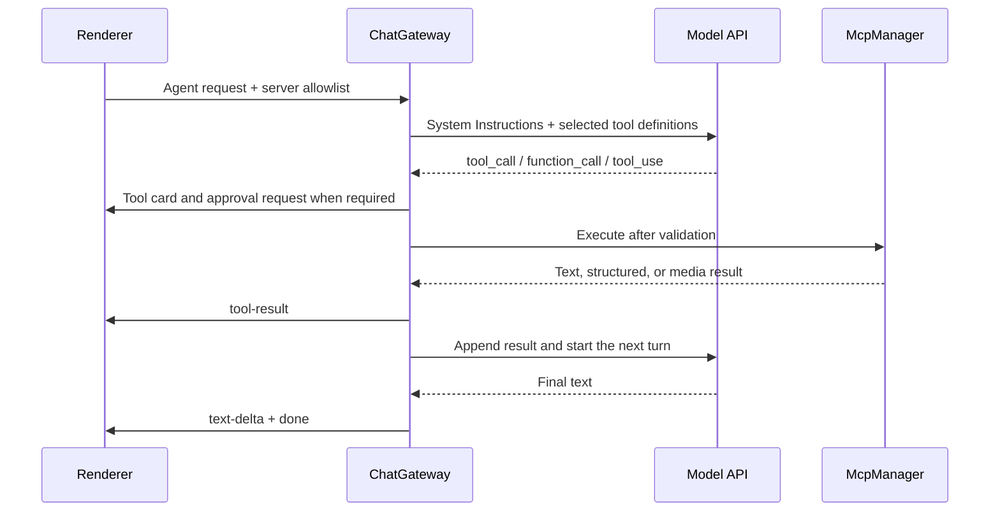

# 5. MCP Integration and Intelligent Tool Retrieval

> [中文文档](../docs_zh/mcp-integration.md)

The Model Context Protocol (MCP) is an open protocol for tool integration. AgentBox uses the official TypeScript SDK to manage MCP client lifecycles, while the Gateway enforces server allowlists, tool retrieval, argument validation, user approval, and multi-turn execution.

---

## Transports and Connection Lifecycle

```text
+--------------------------------------------------------------------+
|                         ChatGateway                                |
|          Tool selection / approval / multi-turn execution          |
+--------------------------------------------------------------------+
                                  |
                                  v
+--------------------------------------------------------------------+
|                         McpManager                                 |
|          Client pool / paginated listing / aggregation             |
+--------------------------------------------------------------------+
                   |                                  |
                   v                                  v
+------------------------------------+  +----------------------------+
| Official StdioClientTransport      |  | Remote HTTP transports     |
| child process + JSON-RPC            |  | Streamable HTTP / legacy HTTP+SSE|
+------------------------------------+  +----------------------------+
```

The persisted transport values map to SDK transports as follows:

| Config value | SDK transport                   | Behavior                                                                                                                       |
| ------------ | ------------------------------- | ------------------------------------------------------------------------------------------------------------------------------ |
| `stdio`      | `StdioClientTransport`          | Starts a local command and exchanges JSON-RPC over stdin/stdout.                                                               |
| `http`       | `StreamableHTTPClientTransport` | Tries the current Streamable HTTP transport first, then automatically falls back to legacy HTTP+SSE if connection setup fails. |
| `sse`        | `SSEClientTransport`            | Explicitly uses legacy HTTP+SSE without first trying Streamable HTTP.                                                          |

- A Stdio child receives the SDK's safe default environment plus environment variables configured for that MCP server. Its per-message buffer limit is 10 MiB.
- Streamable HTTP uses bounded reconnection settings (500 ms initial delay, 10 seconds maximum, and 3 retries). The SDK handles session IDs, protocol-version headers, and SSE streams.
- A remote HTTP endpoint must use HTTPS; plain HTTP is allowed only for loopback hosts. Saving a URL removes user information, query parameters, and fragments, so authentication should be supplied through custom request headers. Every remote MCP request uses `redirect: "error"`; redirects are rejected rather than followed to an unvalidated destination.
- Stdio environment variables and remote headers are stored in the encrypted Vault. Renderer-facing configuration contains only same-key masked values. Controlled headers such as `Host`, `Content-Length`, cookies, and proxy authorization are rejected.
- Remote MCP requests honor the application's custom network proxy setting.
- [`McpManager`](../src/electron/mcp/mcp-manager.ts) reuses clients whose configuration has not changed and aggregates tools with a maximum concurrency of 8 servers. Each tool-list page has a 30-second timeout, with limits of 64 pages and 2,000 tools per server. A tool-list change notification is currently logged; the next listing fetches the list again.

The transport implementation is in [`src/electron/mcp/mcp-client.ts`](../src/electron/mcp/mcp-client.ts).

---

## BM25 Retrieval and the Conversation Allowlist

[`src/electron/mcp/tool-retriever.ts`](../src/electron/mcp/tool-retriever.ts) builds a retrieval document from each tool's name, server name, description, parameter names, and parameter descriptions, then applies BM25 scoring to English and Chinese terms:

- **Automatic retrieval (`auto`)**: the Gateway uses the latest user message as the query and exposes up to 8 MCP tools scoring at least 0.75. Exact tool-name and name-fragment matches receive extra weight. It does not pad an empty or short result with unrelated tools.
- **Expose all (`all`)**: exposes every MCP tool allowed for the conversation without relevance filtering.
- With dynamic Agent tool exposure disabled (the compatibility default), retrieval applies only to external MCP tools. Built-in Agent tools such as `agentbox_load_skill`, the code runner, workspace file tools, and the integrated terminal are appended when available and do not participate in BM25 ranking.
- With dynamic exposure enabled, the same ranking is applied to the complete request-authorized built-in/MCP catalog and the configured initial limit defaults to four tools. The always-mounted, read-only `agentbox_search_tools` fallback searches only that authorized catalog and mounts its matches for the next model turn; it does not execute them. A snapshot of the tools exposed at model invocation prevents a search call from authorizing a second call in the same model response.

Each conversation establishes a server allowlist through `mcpServerIds`:

- If the field is absent, tools may be aggregated from every globally enabled MCP server.
- An empty array allows no MCP servers.
- A non-empty array allows only listed servers that remain globally enabled. Missing or disabled IDs expose no tools.

To prevent collisions and forged calls, the model receives a provider-safe alias of at most 64 characters containing server/tool hashes. The executor accepts only aliases actually exposed during the current turn, then routes them back to the original server ID and tool name.

---

## Multi-turn Agent Execution



- The Gateway bridges OpenAI Chat Completions API `tool_calls`, OpenAI Responses API `function_call` items, and Anthropic Messages API `tool_use` blocks.
- A request-scoped LangGraph runtime controls model/tool/terminal transitions, while the Gateway callbacks retain argument validation, approval, execution, event emission, and provider-history construction.
- The Agent tool-turn limit defaults to 30 and can be configured from 1 to 100. When the limit is reached, calls not yet executed in that turn receive an error result.
- `agentTrace` is an ordered, protocol-neutral ledger of assistant text, Anthropic signed thinking blocks, completed Responses reasoning items, tool calls, tool results, and required provider items. Generic visible Chat/Responses reasoning remains in `Message.reasoning` and is not necessarily protocol replay state. The trace supports faithful replay in later turns.
- Agent requests with renderer response IDs also write an encrypted LangGraph checkpoint thread. Only provider-node failures resume that thread directly; cancellations and uncertain tool-side-effect paths restart through the completed/error results in `agentTrace` to avoid duplicate writes or execution.
- Rate limits, network/API errors, output limits (including OpenAI Responses `max_output_tokens`), the tool-turn limit, and user cancellation produce an `interruption` checkpoint. Resume reuses completed results; before retrying an operation with unknown status and possible side effects, the Agent should inspect external state.
- Short instructions such as `go`, `continue`, `resume`, `retry`, or `继续` are treated as resume requests only when the last Assistant message on the active branch contains a checkpoint. Attachments or substantive new requirements remain new requests.

---

## Approval Policy and Execution Boundaries

Every tool call is parsed as JSON and checked against the tool's input JSON Schema. Invalid JSON, schema mismatches, unknown tools, and tools not exposed during the current turn are never executed.

### Approval modes

| Setting                                                 | Effective behavior                                                                                                                                                                                                                                      |
| ------------------------------------------------------- | ------------------------------------------------------------------------------------------------------------------------------------------------------------------------------------------------------------------------------------------------------- |
| **Confirm sensitive operations (`sensitive`, default)** | A tool runs automatically only if it declares all three conditions: `readOnlyHint: true`, `destructiveHint: false`, and `openWorldHint: false`. Every other tool requires approval.                                                                     |
| **Always confirm (`always`)**                           | Every code, terminal, workspace, and MCP tool call requires approval. Local catalog/result/Skill-resource readers do not create side effects and run without approval.                                                                                  |
| **Full Access (`full-access`)**                         | Skips approval for code, terminal, workspace file, external MCP, and built-in browser operations, including page sharing, interaction, upload, and download. It does not relax hard URL, path, schema, timeout, sensitive-field, or result-size checks. |

Built-in tools add these fixed rules:

- `agentbox_load_skill` loads local documents from an enabled skill and never executes its scripts, so it completes without an approval prompt.
- `agentbox_search_tools`, `agentbox_read_tool_result`, and `agentbox_read_skill_resource` inspect request-authorized in-memory or local data only. They never execute a searched tool or Skill script and do not prompt for approval.
- `agentbox_run_code` and `agentbox_run_terminal` are always classified as sensitive. They require approval under every mode except Full Access.
- `agentbox_read_file` carries a complete read-only, non-destructive, closed-world declaration and may run automatically under the default policy. `agentbox_write_file` is a destructive write and requires approval.
- The optional `agentbox_browser_*` family is exposed only when both the application-level browser and the conversation-level Browser tools switch are enabled. `agentbox_browser_tabs` lists stable tab IDs and creates, activates, or closes tabs. Under the default policy, new-origin navigation prompts unless an in-memory origin read grant exists; navigation approval can grant read capability for that origin, so snapshot, screenshot, and scroll do not always produce a separate first-read prompt. Origin grants never authorize click, type, upload, or download. Clicks and text entry remain sensitive. Password, hidden, file, and fields recognized through supported password, `one-time-code`, or `cc-*` autocomplete metadata are hard-blocked even under Full Access. Screenshot, upload, and download tools appear only under their independent settings; Agent uploads and downloads are constrained to the conversation working directory.
- `ToolAnnotations` on an external MCP tool are claims made by its server. If any part of the complete low-risk declaration is missing, the default policy treats the tool as sensitive.

An approval waits for 5 minutes by default, or indefinitely when configured. The 120-second network-stall watchdog is paused during approval. Rejection, request cancellation, or the end of the request lifecycle terminates the wait. Full Access is appropriate only for fully trusted models, MCP servers, websites, and tasks.

### Isolated multi-tab browser

The browser is an internal AgentBox tool service, not an MCP server process, although it reuses `McpToolDefinition`, provider adapters, JSON Schema validation, tool cards, approval waits, `toolExecutions`, and `agentTrace`. Each result names its `tab_id`. `agentbox_browser_navigate` opens a policy-checked URL without returning page content. `agentbox_browser_snapshot` returns bounded visible text and short-lived element references marked as untrusted. Click, type, upload, download, and scroll operations accept only references from the latest snapshot of the same tab; navigation or interaction invalidates those references. The screenshot tool returns a bounded JPEG result. Responses and Anthropic replay it inside the tool result; Chat Completions closes the text-only tool message and follows it with an explicitly labeled untrusted user-image input because the [official tool-message schema](https://developers.openai.com/api/reference/resources/chat/subresources/completions/methods/create) accepts text only.

Each resident conversation browser uses one non-persistent Electron session shared by its tabs. AgentBox keeps at most three live sessions and evicts the least-recently-used hidden session before creating a fourth; its tabs, history, DOM state, and site storage are then lost. Popups become policy-checked tabs; web permissions, embedded credentials, unsupported schemes, `.local` names, literal/private or DNS-resolved private-network destinations, and recognized sensitive form fields remain blocked. Public HTTPS is the default; plain HTTP is available only for explicitly enabled loopback development URLs. The same private-network policy covers subresources, while `data:` and `blob:` are allowed only as subresources. Cookie persistence, when enabled, snapshots accepted Chromium cookies into an encrypted per-conversation Vault profile and restores them into a new memory session; cache, storage, DOM state, tab history, references, and origin grants never persist. Manual downloads go to the system Downloads directory, while Agent downloads wait for completion and create a non-overwriting workspace-relative file; every browser download is capped at 100 MiB. Enabling browser uploads also permits the normal user-operated file chooser, whose choices are not workspace-scoped. The distinct Agent upload tool accepts up to ten regular non-symlink workspace files, 25 MiB each and 100 MiB total.

### Resource and data boundaries

- Browser URLs are limited to 4,096 characters. Navigation defaults to 20 seconds and accepts 3–30 seconds. A serialized snapshot retains at most 100,000 characters and the first 500 interactive references; a returned chunk defaults to 16,000 characters and accepts 2,000–32,000. Screenshot dimensions default to 1,280 pixels and accept 512–1,600; the resulting JPEG Base64 payload is capped at 2,097,152 characters.
- MCP `callTool` has a 60-second timeout and receives the request cancellation signal.
- MCP retains at most 100 rich-content entries. Text plus structured content share a 100,000-character aggregate budget; the flattened result is likewise capped near 100,000 characters. Base64 data for each image, audio item, or binary resource is limited to 2 MiB, and all retained binary payloads share a 2 MiB aggregate budget; over-limit data is omitted or marked as truncated.
- `agentbox_read_file` and `agentbox_write_file` reject absolute paths, `..`, UNC paths, and symlinks inside the working directory. Reads accept only regular UTF-8 files up to 2 MiB; a single write is constrained by both 100,000 characters and 512 KiB.
- Tool descriptions, arguments, results, and external resources are untrusted data and cannot override higher-priority instructions.
- The integrated terminal receives only an initial `cwd`; it is not an operating-system sandbox. An approved command can still use absolute paths, access files outside the working directory, launch processes, or use the network. See [Conversation Working Directories and Developer Runtimes](workspaces-and-runtimes.md).

---

## UI and Diagnostics

1. **Settings → MCP External Tools**: create, enable, disable, and test stdio, Streamable HTTP, or legacy HTTP+SSE configurations. A test reports the transport that actually connected, the negotiated protocol version, and the tool count.
2. **Tool Explorer**: combines enabled MCP tools with AgentBox built-in tools, supports source filtering, and displays input schemas. Workspace file tools appear in the catalog but are mounted only in an Agent conversation that has a working directory.
3. **Composer allowlist**: selects the MCP servers available to the current conversation.
4. **Tool cards**: show awaiting approval, executing, completed, denied, or error states, along with arguments and truncated results.
5. **Interruption recovery**: users can resume from a checkpoint or regenerate from the original user request. These options have different side-effect semantics.

## data-plat

Data platform servers can opt into exact execution confirmation, per-operation OBO credentials, and conservative history recovery. JSON Schema 2020-12 uses Ajv2020; absent/draft-07 declarations remain supported and unknown dialects are rejected. See [data-plat integration](data-plat-integration.md).
