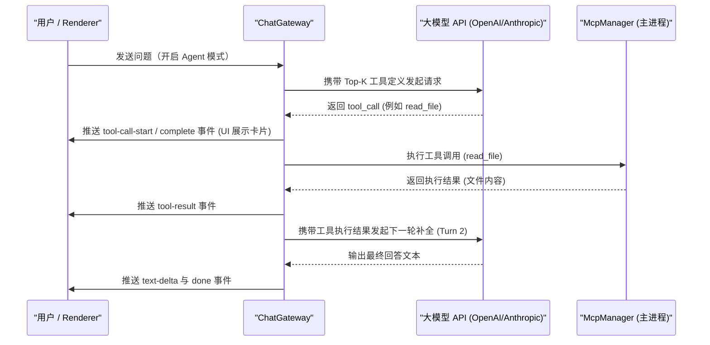

# 5. MCP 外部工具协议与智能检索

Model Context Protocol (MCP) 是开放的工具集成标准。AgentBox 基于官方 TypeScript SDK 实现客户端生命周期、智能工具检索、权限审批与多轮执行循环。

---

## 🔌 传输架构（Stdio、Streamable HTTP 与旧 SSE）

```text
+--------------------------------------------------------------------+
|                         ChatGateway                                |
|             (Multi-turn Tool Loop / Prompt Augmentation)           |
+--------------------------------------------------------------------+
                                  |
                                  v
+--------------------------------------------------------------------+
|                         McpManager                                 |
|             (Client Pool / Caching / Tool Aggregation)             |
+--------------------------------------------------------------------+
                   |                                  |
                   v                                  v
+------------------------------------+  +----------------------------+
| Official StdioClientTransport      |  | StreamableHTTPClientTransport |
| child_process + JSON-RPC           |  | HTTP POST/GET + optional SSE  |
+------------------------------------+  +----------------------------+
                   |                                  |
                   v                                  v
     [Local Python/Node/CLI MCP]             [Remote MCP Server]
```

### 1. Stdio Transport（本地子进程）
- 使用官方 `StdioClientTransport` 启动本地命令，继承经过 SDK 筛选的安全环境变量并叠加用户配置。
- 单条协议消息限制为 10 MiB；SDK 负责 JSON-RPC、版本协商、取消通知和进程关闭。

### 2. Streamable HTTP（远程服务）
- 新配置默认使用当前标准 Streamable HTTP，自动处理协议版本头、会话 ID、SSE 流恢复和重连。
- 若现代握手失败，可回退到旧 HTTP+SSE；也可在配置中显式选择旧 SSE。
- 自定义认证头在加密 Vault 中保存，Renderer 只能看到遮罩值；所有远程请求遵循应用代理设置。

---

## 🎯 BM25 智能工具检索引擎（Tool Retriever）

在大规模工具集成场景下，将所有工具完整注入请求体会迅速耗尽上下文并导致模型注意力分散。AgentBox 在 [`src/electron/mcp/tool-retriever.ts`](../src/electron/mcp/tool-retriever.ts) 中实现了智能检索引擎：

- **分词与索引**：提取用户 Prompt 中的中英文词汇与 N-gram 关键片段。
- **相关度评分**：使用 BM25 的 TF、IDF 与文档长度归一化，并对工具名精确命中增加权重。
- **检索模式**：
  - **智能检索（`auto`）**：只注入超过最低相关度阈值的前 8 个工具；无相关工具时不做任意补齐。
  - **全部挂载（`all`）**：加载所有已启用服务的全部工具。

---

## 🔄 Agent 多轮自主执行循环（Multi-turn Execution Loop）

当大模型在回复过程中发起工具调用时，网关层自动执行闭环处理：



- **最大循环轮次**：支持最多 6 轮连续工具调用。
- **跨协议格式映射**：在 OpenAI `tool_calls`、Responses `function_call` 与 Anthropic `tool_use` 之间自动桥接。
- **有序事件账本**：`agentTrace` 保留每轮文本、工具调用与工具结果，确保后续对话可以按协议正确重放。
- **唯一工具路由**：模型只看到服务器作用域内的安全别名；执行器仅接受本轮实际暴露的别名。

---

## 🛡️ 权限、安全与资源边界

- 默认采用“智能确认”：只有服务器明确声明为只读、非破坏且封闭环境的工具可以自动执行，其余调用必须由用户批准。
- 可在设置中切换为“每次确认”或“从不确认”；后者仅适合完全可信的本地环境。
- 调用前使用 JSON Schema 校验参数；非法 JSON、未知工具、未暴露工具和 Schema 不匹配均不会执行。
- 工具请求支持取消和 60 秒超时；文本结果限制为 100,000 字符，二进制结果限制为 2 MiB。
- 工具描述和返回内容始终按不可信数据处理，不会被提升为系统指令。
- 每个会话可单独选择允许暴露的 MCP 服务，空列表表示不允许任何 MCP 服务。

---

## 🖥️ UI 组件与交互

1. **设置中心与 Tool Explorer**：在「设置 → MCP 外部工具」中测试连接和传输类型，浏览工具参数 Schema。
2. **会话白名单**：Composer 的 MCP 菜单用于选择当前会话可使用的服务器。
3. **交互式卡片**：聊天气泡实时显示等待审批、执行中、完成、拒绝和错误状态，并展示参数与截断后的结果。
