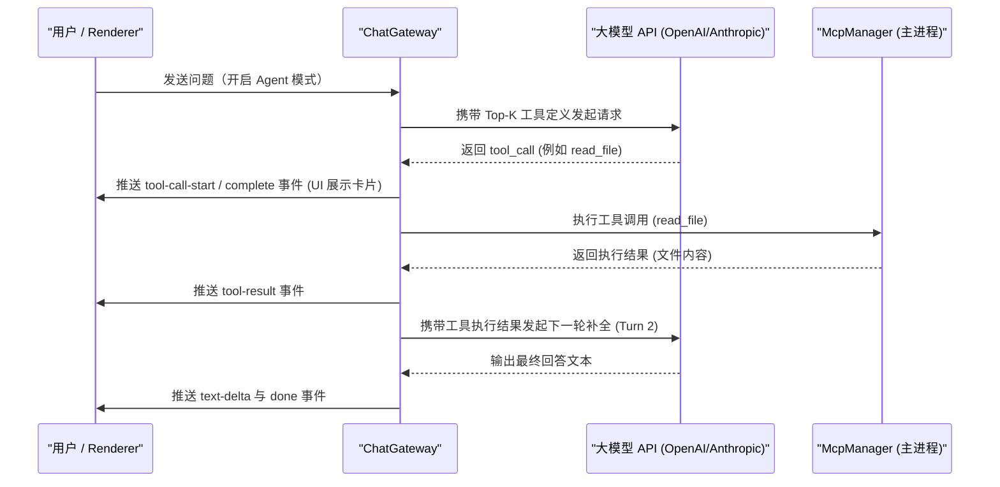

# 5. MCP 外部工具协议与智能检索

Model Context Protocol (MCP) 是开放的工具集成标准。AgentBox 实现了完整的 MCP Client 运行时、智能工具检索与多轮自主执行循环。

---

## 🔌 双传输通道架构（Stdio & SSE）

```text
+--------------------------------------------------------------------+
|                         ChatGateway                                |
|             (Multi-turn Tool Loop / Prompt Augmentation)           |
+--------------------------------------------------------------------+
                                  |
                                  v
+--------------------------------------------------------------------+
|                         McpManager                                 |
|             (Client Pool / Caching / Tool Aggregation)             |
+--------------------------------------------------------------------+
                   |                                  |
                   v                                  v
+------------------------------------+  +----------------------------+
|        StdioTransport              |  |        SseTransport        |
|  child_process.spawn (JSON-RPC)    |  |  EventSource + HTTP POST   |
+------------------------------------+  +----------------------------+
                   |                                  |
                   v                                  v
     [Local Python/Node/CLI MCP]             [Remote SSE MCP Server]
```

### 1. Stdio Transport (本地子进程)
- 通过 `child_process.spawn` 启动本地命令（如 `npx`, `uvx`, `python`, `node`）。
- 监听标准输出并按行切分（Line-buffered），解析 JSON-RPC 2.0 响应。
- 支持注入自定义环境变量（`env`），具备请求超时（默认 30s）与退出清理机制。

### 2. SSE Transport (网络服务)
- 通过 HTTP Server-Sent Events 连接远程端点，监听服务端推送的 JSON-RPC 消息。
- 通过 HTTP POST 发送客户端请求，支持自定义 HTTP Headers（如 `Authorization`）。

---

## 🎯 BM25 智能工具检索引擎（Tool Retriever）

在大规模工具集成场景下，将所有工具完整注入请求体会迅速耗尽上下文并导致模型注意力分散。AgentBox 在 [`src/electron/mcp/tool-retriever.ts`](../src/electron/mcp/tool-retriever.ts) 中实现了智能检索引擎：

- **分词与索引**：提取用户 Prompt 中的中英文词汇与 N-gram 关键片段。
- **相关度加权评分**：
  - 工具名称精确/前缀匹配：+10.0 ~ +15.0 分
  - 参数字段名称与类型匹配：+4.0 分
  - 工具描述词频与语义匹配：+2.0 ~ +3.0 分
- **检索模式**：
  - **智能检索（`auto`）**：动态选取评分最高的前 8 个（Top-K）工具注入大模型请求。
  - **全部挂载（`all`）**：加载所有已启用服务的全部工具。

---

## 🔄 Agent 多轮自主执行循环（Multi-turn Execution Loop）

当大模型在回复过程中发起工具调用时，网关层自动执行闭环处理：



- **最大循环轮次**：支持最多 6 轮连续工具调用。
- **跨协议格式映射**：在 OpenAI `tool_calls`、Responses `function_call` 与 Anthropic `tool_use` 之间自动桥接。

---

## 🖥️ UI 组件与交互

1. **设置中心与 Tool Explorer**：在「设置 → MCP 外部工具」中测试连接延迟，浏览所有发现工具的参数 Schema。
2. **交互式卡片**：聊天气泡中实时渲染状态徽章（执行中/完成/错误）、耗时、入参 JSON 与执行结果，支持折叠展开。
