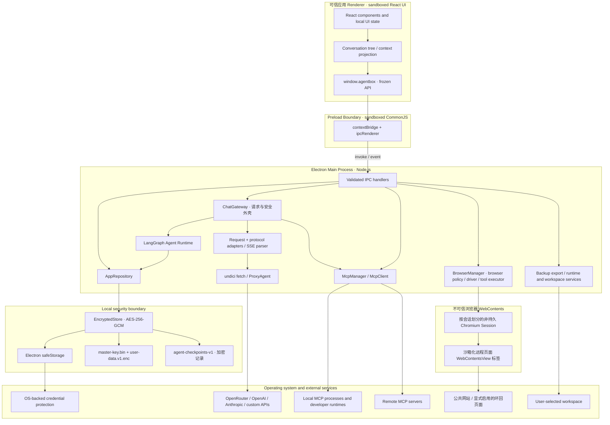

# 1. 系统架构概览

> English: [System Architecture Overview](../docs/architecture.md)

AgentBox 是一个本地优先的桌面 Agent 与多模型 AI 客户端。当前工程基于 **React 19、TypeScript 5.7、Electron 35、Vite 5.4 和 electron-vite 3**；版本范围以 [`package.json`](../package.json) 为准。

---

## 🏗️ 总体架构

可信应用 Renderer 只负责展示和交互。持久化、供应商请求、MCP 连接、终端与运行时探测、工作区文件访问、备份导出等具有系统权限的操作均由主进程完成。Preload 是这两个应用进程之间唯一公开的桥接层。可选远程浏览器页面是由主进程管理的独立沙箱化 Chromium WebContents；它们通过自己的 Session 发起 Chromium 网络请求，绝不接收应用的 preload 或 IPC。

---

## 🔒 进程隔离与安全边界

### 1. 渲染进程（Renderer Process）

- **Electron 沙箱**：窗口启用 `sandbox: true`、`contextIsolation: true`、`nodeIntegration: false`、`webSecurity: true` 和 `allowRunningInsecureContent: false`。
- **无 Node.js 或直接网络权限**：可信应用 Renderer 的生产 CSP 使用 `connect-src 'none'`，并禁止对象、frame、worker、media、manifest 与表单提交。开发服务器运行时，构建插件只额外允许同源连接和 WebSocket。该规则不描述独立的不可信浏览器 WebContents；后者的 Chromium 请求由 `BrowserManager` 的 Session 策略控制。
- **最小化敏感数据暴露**：供应商列表使用 `ProviderView`，只返回 `hasApiKey`，不返回 API Key；MCP 环境变量和请求头、带凭据的代理 URL 在返回 renderer 前会被掩码。Vault 主密钥从不经过 IPC。

安全配置分别位于 [`src/electron/main.ts`](../src/electron/main.ts)、[`src/renderer/index.html`](../src/renderer/index.html) 与 [`electron.vite.config.ts`](../electron.vite.config.ts)。

### 2. Preload 边界（Preload Bridge）

- [`src/electron/preload.ts`](../src/electron/preload.ts) 仅通过 `contextBridge.exposeInMainWorld('agentbox', ...)` 暴露按领域分组的方法，并递归冻结公开对象。
- Renderer 只能调用固定的 `ipcRenderer.invoke` 通道，并有两条类型化事件订阅：`chat:event` 用于归一化模型/工具流事件，`browser:event` 用于脱敏浏览器状态或下载元数据；不会获得通用 IPC、文件系统或进程 API。
- 沙箱化 preload 构建为 CommonJS 单文件 `out/preload/index.cjs`。主进程同样构建为 `out/main/index.cjs`，以兼容打包进 ASAR 后的 CommonJS 依赖解析。

### 3. 主进程（Main Process）

- **统一 IPC 校验**：[`src/electron/ipc/register-ipc.ts`](../src/electron/ipc/register-ipc.ts) 的注册辅助函数对每次 invoke 同时校验 `webContents.id`、顶层 `senderFrame`，以及精确的生产 `file:` 页面或开发服务器 origin/path。子 frame 和未知页面会被拒绝。
- **默认拒绝权限**：默认 session 的权限请求和权限检查均返回拒绝。
- **阻止 renderer 导航**：`will-navigate` 阻止离开当前页面；`setWindowOpenHandler` 总是拒绝创建新窗口。只有语法有效、使用 `http:`/`https:` 且不含嵌入式用户名或密码的 URL 才会交给 `shell.openExternal`。这里没有域名白名单。
- **单实例与资源回收**：应用使用单实例锁。窗口关闭时会取消活动生成、结束相关工具审批并关闭 MCP 客户端；应用退出时还会销毁内存中的 Vault 状态与密钥。
- **隔离式多标签浏览器**：可选内置浏览器由主进程中的 `BrowserManager` 持有。Session 按需创建；AgentBox 最多保留三个活动 Session，同时只显示一个 Session，每个 Session 最多十二个沙箱化 `WebContentsView` 标签页。打开第四个 Session 会关闭最久未使用的隐藏 Session。远程页面没有 preload、Node.js、AgentBox IPC、DevTools 或已授予的 Web 权限；新窗口会转换为经过策略检查的标签页。设置或新建对话框打开时会隐藏浏览器 View；删除对话、关闭窗口或退出应用时会销毁对应会话。Chromium Session 流量通过 `Session.setProxy` 使用自定义代理；供应商/MCP 的 `undici.ProxyAgent` 调度保持独立。下载、上传、截图、环回 HTTP 和 Cookie 持久化均使用互相独立的显式设置。

---

## 📡 IPC 契约

通道常量集中定义于 [`src/shared/ipc.ts`](../src/shared/ipc.ts)，公开方法及其类型定义于 [`src/electron/preload.ts`](../src/electron/preload.ts) 和 [`src/shared/types.ts`](../src/shared/types.ts)。当前没有旧版 `vault:*` 或 `chat:stream` 通道。

| 领域         | 通道                                                                                                                                                                              | 用途                                                                                                                                                                                                                                                                              |
| ------------ | --------------------------------------------------------------------------------------------------------------------------------------------------------------------------------- | --------------------------------------------------------------------------------------------------------------------------------------------------------------------------------------------------------------------------------------------------------------------------------- |
| 设置         | `settings:get`, `settings:update`                                                                                                                                                 | 读取或更新应用设置；返回前掩码代理凭据                                                                                                                                                                                                                                            |
| 供应商       | `providers:list`, `providers:upsert`, `providers:remove`, `providers:test`                                                                                                        | 管理连接、写入 API Key、测试模型列表端点                                                                                                                                                                                                                                          |
| 模型         | `models:list`, `models:upsert`, `models:remove`, `models:discover`                                                                                                                | 管理本地模型配置并发现远程模型                                                                                                                                                                                                                                                    |
| Skills       | `skills:list`, `skills:upsert`, `skills:remove`, `skills:toggle`, `skills:reset-defaults`                                                                                         | 管理技能包、开关和内置技能重置                                                                                                                                                                                                                                                    |
| MCP          | `mcp:list-servers`, `mcp:upsert-server`, `mcp:remove-server`, `mcp:toggle-server`, `mcp:test-server`, `mcp:list-tools`                                                            | 管理 MCP server、测试连接并查询工具                                                                                                                                                                                                                                               |
| 终端与运行时 | `terminal:test-shell`, `runtime:test`, `runtime:list-conda-environments`                                                                                                          | 测试集成终端 Shell 与开发运行时，列出 Conda 环境                                                                                                                                                                                                                                  |
| 工作区       | `workspace:get-default-directory`、`workspace:select-directory`                                                                                                                   | 由主进程确保并返回应用同目录的默认工作区，或打开系统目录选择器并返回规范化绝对路径                                                                                                                                                                                                |
| 会话         | `conversations:list`, `conversations:get`, `conversations:save`, `conversations:remove`                                                                                           | 读取和持久化会话树                                                                                                                                                                                                                                                                |
| 数据         | `data:export-backup`, `data:clear-conversations`                                                                                                                                  | 导出浅/深 ZIP 备份或清除全部会话                                                                                                                                                                                                                                                  |
| Chat         | `chat:start`, `chat:cancel`, `chat:resolve-tool-approval`                                                                                                                         | 启动请求、按 `requestId` 取消请求、处理工具审批                                                                                                                                                                                                                                   |
| 流事件       | `chat:event`                                                                                                                                                                      | 主进程向 renderer 推送 `StreamEvent`：文本、推理、来源、工具、用量、完成或错误                                                                                                                                                                                                    |
| 浏览器       | `browser:ensure`, `browser:navigate`, `browser:command`, `browser:new-tab`, `browser:switch-tab`, `browser:close-tab`, `browser:set-view-state`, `browser:close`, `browser:event` | 控制用户可见标签页，并发布脱敏 `BrowserState` 元数据（`activeTabId`、标签 `id`）或下载名称/进度元数据；Cookie profile/值、浏览器绝对路径、DOM 状态、来源授权和活动页面存储仍留在主进程。经过批准的 Agent 快照和截图字节则作为 `chat:event` 工具结果单独传递，并成为加密对话数据。 |
| 应用         | `app:get-info`                                                                                                                                                                    | 返回应用名称、版本和平台                                                                                                                                                                                                                                                          |

`chat:start` 返回新生成的 `{ requestId }`。后续取消、工具审批和流事件都以该请求 ID 关联，而不是以会话 ID 直接控制正在运行的生成。

---

## 🔗 关键实现

- [`src/electron/main.ts`](../src/electron/main.ts)：窗口、安全策略、应用生命周期与服务装配
- [`src/electron/preload.ts`](../src/electron/preload.ts)：renderer 可见 API
- [`src/electron/ipc/register-ipc.ts`](../src/electron/ipc/register-ipc.ts)：IPC 注册、输入入口与可信发送方校验
- [`src/electron/api/gateway.ts`](../src/electron/api/gateway.ts)：请求编排、流处理和 Agent 工具循环
- [`src/electron/api/agent-runtime.ts`](../src/electron/api/agent-runtime.ts)：provider-neutral 的 LangGraph model/tool/终态转换状态机
- [`src/electron/browser/browser-manager.ts`](../src/electron/browser/browser-manager.ts)：隔离浏览器 session、标签/View 生命周期、Chromium 代理/Session 策略、下载与 Cookie 快照
- [`src/electron/browser/browser-policy.ts`](../src/electron/browser/browser-policy.ts)：公共目标、环回、私有网络、凭据和 URL 脱敏策略
- [`src/electron/browser/browser-driver.ts`](../src/electron/browser/browser-driver.ts)：isolated-world DOM 快照/交互和受控文件输入操作
- [`src/electron/browser/browser-tool-executor.ts`](../src/electron/browser/browser-tool-executor.ts)：参数级浏览器审批、来源授权和 Gateway 分发
- [`src/renderer/src/components/browser/BrowserPanel.tsx`](../src/renderer/src/components/browser/BrowserPanel.tsx)：标签页控件和类型化原生 View 边界上报
- [`src/electron/storage/agentbox-checkpoint-saver.ts`](../src/electron/storage/agentbox-checkpoint-saver.ts)：加密 `BaseCheckpointSaver` 适配器与消息 snapshot/delta 重建
- [`src/electron/storage/checkpoint-repository.ts`](../src/electron/storage/checkpoint-repository.ts)：checkpoint 配额、manifest、生命周期删除与恢复
- [`src/electron/storage/app-repository.ts`](../src/electron/storage/app-repository.ts)：Vault 领域仓库与 Schema 校验
- [`src/electron/mcp/mcp-manager.ts`](../src/electron/mcp/mcp-manager.ts)：MCP 客户端生命周期与代理分发
