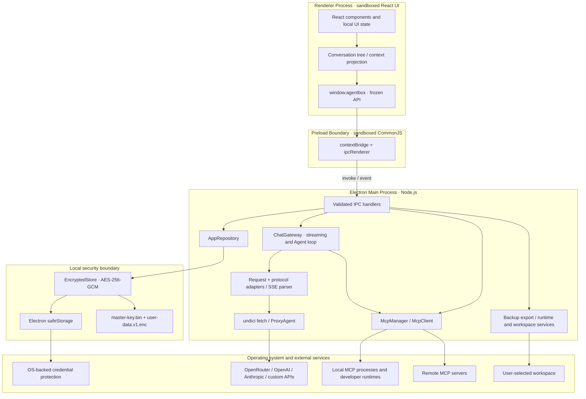

# 1. 系统架构概览

> English: [System Architecture Overview](../docs/architecture.md)

AgentBox 是一个本地优先的桌面 Agent 与多模型 AI 客户端。当前工程基于 **React 19、TypeScript 5.7、Electron 35、Vite 5.4 和 electron-vite 3**；版本范围以 [`package.json`](../package.json) 为准。

---

## 🏗️ 总体架构

渲染进程只负责展示和交互。持久化、供应商请求、MCP 连接、终端与运行时探测、工作区文件访问、备份导出等具有系统权限的操作均由主进程完成。Preload 是两者之间唯一公开的应用桥接层。

---

## 🔒 进程隔离与安全边界

### 1. 渲染进程（Renderer Process）

- **Electron 沙箱**：窗口启用 `sandbox: true`、`contextIsolation: true`、`nodeIntegration: false`、`webSecurity: true` 和 `allowRunningInsecureContent: false`。
- **无 Node.js 或直接网络权限**：生产 CSP 使用 `connect-src 'none'`，并禁止对象、frame、worker、media、manifest 与表单提交。开发服务器运行时，构建插件只额外允许同源连接和 WebSocket。
- **最小化敏感数据暴露**：供应商列表使用 `ProviderView`，只返回 `hasApiKey`，不返回 API Key；MCP 环境变量和请求头、带凭据的代理 URL 在返回 renderer 前会被掩码。Vault 主密钥从不经过 IPC。

安全配置分别位于 [`src/electron/main.ts`](../src/electron/main.ts)、[`src/renderer/index.html`](../src/renderer/index.html) 与 [`electron.vite.config.ts`](../electron.vite.config.ts)。

### 2. Preload 边界（Preload Bridge）

- [`src/electron/preload.ts`](../src/electron/preload.ts) 仅通过 `contextBridge.exposeInMainWorld('agentbox', ...)` 暴露按领域分组的方法，并递归冻结公开对象。
- Renderer 只能调用固定的 `ipcRenderer.invoke` 通道，并通过单一 `chat:event` 监听流事件；不会获得通用 IPC、文件系统或进程 API。
- 沙箱化 preload 构建为 CommonJS 单文件 `out/preload/index.cjs`。主进程同样构建为 `out/main/index.cjs`，以兼容打包进 ASAR 后的 CommonJS 依赖解析。

### 3. 主进程（Main Process）

- **统一 IPC 校验**：[`src/electron/ipc/register-ipc.ts`](../src/electron/ipc/register-ipc.ts) 的注册辅助函数对每次 invoke 同时校验 `webContents.id`、顶层 `senderFrame`，以及精确的生产 `file:` 页面或开发服务器 origin/path。子 frame 和未知页面会被拒绝。
- **默认拒绝权限**：默认 session 的权限请求和权限检查均返回拒绝。
- **阻止 renderer 导航**：`will-navigate` 阻止离开当前页面；`setWindowOpenHandler` 总是拒绝创建新窗口。只有语法有效、使用 `http:`/`https:` 且不含嵌入式用户名或密码的 URL 才会交给 `shell.openExternal`。这里没有域名白名单。
- **单实例与资源回收**：应用使用单实例锁。窗口关闭时会取消活动生成、结束相关工具审批并关闭 MCP 客户端；应用退出时还会销毁内存中的 Vault 状态与密钥。

---

## 📡 IPC 契约

通道常量集中定义于 [`src/shared/ipc.ts`](../src/shared/ipc.ts)，公开方法及其类型定义于 [`src/electron/preload.ts`](../src/electron/preload.ts) 和 [`src/shared/types.ts`](../src/shared/types.ts)。当前没有旧版 `vault:*` 或 `chat:stream` 通道。

| 领域         | 通道                                                                                                                   | 用途                                                                           |
| ------------ | ---------------------------------------------------------------------------------------------------------------------- | ------------------------------------------------------------------------------ |
| 设置         | `settings:get`, `settings:update`                                                                                      | 读取或更新应用设置；返回前掩码代理凭据                                         |
| 供应商       | `providers:list`, `providers:upsert`, `providers:remove`, `providers:test`                                             | 管理连接、写入 API Key、测试模型列表端点                                       |
| 模型         | `models:list`, `models:upsert`, `models:remove`, `models:discover`                                                     | 管理本地模型配置并发现远程模型                                                 |
| Skills       | `skills:list`, `skills:upsert`, `skills:remove`, `skills:toggle`, `skills:reset-defaults`                              | 管理技能包、开关和内置技能重置                                                 |
| MCP          | `mcp:list-servers`, `mcp:upsert-server`, `mcp:remove-server`, `mcp:toggle-server`, `mcp:test-server`, `mcp:list-tools` | 管理 MCP server、测试连接并查询工具                                            |
| 终端与运行时 | `terminal:test-shell`, `runtime:test`, `runtime:list-conda-environments`                                               | 测试集成终端 Shell 与开发运行时，列出 Conda 环境                               |
| 工作区       | `workspace:select-directory`                                                                                           | 由主进程打开系统目录选择器并返回规范化绝对路径                                 |
| 会话         | `conversations:list`, `conversations:get`, `conversations:save`, `conversations:remove`                                | 读取和持久化会话树                                                             |
| 数据         | `data:export-backup`, `data:clear-conversations`                                                                       | 导出浅/深 ZIP 备份或清除全部会话                                               |
| Chat         | `chat:start`, `chat:cancel`, `chat:resolve-tool-approval`                                                              | 启动请求、按 `requestId` 取消请求、处理工具审批                                |
| 流事件       | `chat:event`                                                                                                           | 主进程向 renderer 推送 `StreamEvent`：文本、推理、来源、工具、用量、完成或错误 |
| 应用         | `app:get-info`                                                                                                         | 返回应用名称、版本和平台                                                       |

`chat:start` 返回新生成的 `{ requestId }`。后续取消、工具审批和流事件都以该请求 ID 关联，而不是以会话 ID 直接控制正在运行的生成。

---

## 🔗 关键实现

- [`src/electron/main.ts`](../src/electron/main.ts)：窗口、安全策略、应用生命周期与服务装配
- [`src/electron/preload.ts`](../src/electron/preload.ts)：renderer 可见 API
- [`src/electron/ipc/register-ipc.ts`](../src/electron/ipc/register-ipc.ts)：IPC 注册、输入入口与可信发送方校验
- [`src/electron/api/gateway.ts`](../src/electron/api/gateway.ts)：请求编排、流处理和 Agent 工具循环
- [`src/electron/storage/app-repository.ts`](../src/electron/storage/app-repository.ts)：Vault 领域仓库与 Schema 校验
- [`src/electron/mcp/mcp-manager.ts`](../src/electron/mcp/mcp-manager.ts)：MCP 客户端生命周期与代理分发
