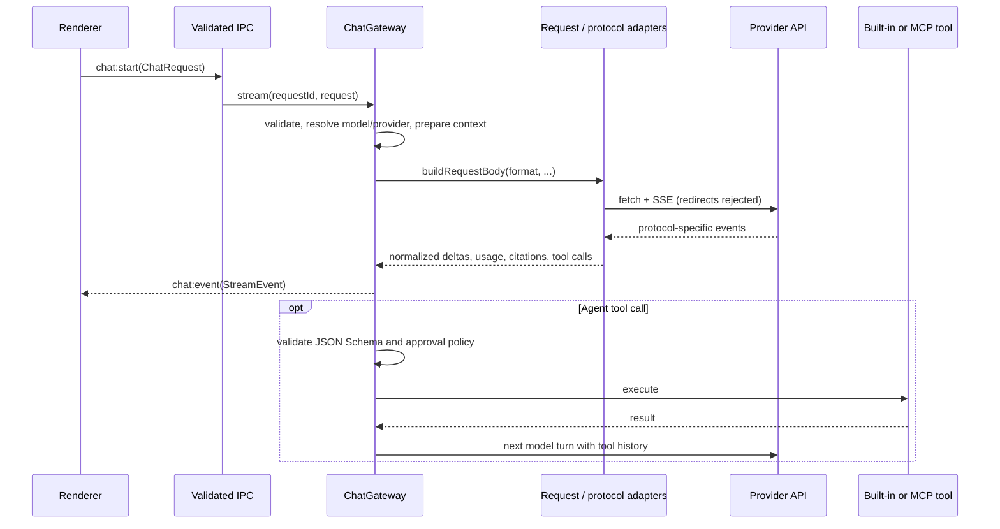

# 3. API 协议与请求网关

> English: [API Protocols and Request Gateway](../docs/gateway-and-protocols.md)

[`ChatGateway`](../src/electron/api/gateway.ts) 是 renderer 与模型供应商之间的主进程编排层：它校验请求、选择模型与供应商、准备上下文、构造协议请求、消费 SSE、归一化流事件，并在 Agent 模式下驱动多轮工具循环。

---

## 🔄 请求生命周期



`chat:start` 立即返回 `requestId`，实际生成异步进行。文本、推理、来源、工具状态、用量、完成与错误都通过 `chat:event` 推送；`chat:cancel` 和工具审批同样使用 `requestId` 关联。

---

## 🌐 三种 API 格式

模型可以用 `ModelConfig.apiFormat` 覆盖供应商的默认格式。端点由规范化后的 Base URL 和下列相对路径组成：

| API 格式 | 端点 | 主要请求结构 | 主要流事件 |
| --- | --- | --- | --- |
| **OpenAI Chat Completions API** | `chat/completions` | `messages`, `tools`, `max_tokens`, `reasoning` / `reasoning_effort` | `choices[].delta.content`, `delta.tool_calls`, `reasoning*`, `usage` |
| **OpenAI Responses API** | `responses` | `instructions`, `input`, function tools, `max_output_tokens`, `reasoning` | `response.output_text.delta`, `response.function_call_arguments.delta`, `response.reasoning*`, terminal response events |
| **Anthropic Messages API** | `messages` | `system`, content-block `messages`, `tools`, `thinking`, `max_tokens` | `content_block_start/delta`, `text_delta`, `thinking_delta`, `signature_delta`, `input_json_delta` |

适配实现分别位于 [`request-adapters.ts`](../src/electron/api/request-adapters.ts) 与 [`protocol-adapters.ts`](../src/electron/api/protocol-adapters.ts)。共享历史会被重建为各协议所需的 assistant tool call / tool result 结构；Responses 的已完成 reasoning item 与 Anthropic thinking signature 会保存在 Agent trace 中，以便下一轮和中断恢复时原样回放协议状态。

### 附件转换

- Chat Completions 把图片转换为 `image_url` content part；文本附件内联为文本。PDF/其他 document 在此格式中只发送附件占位说明。
- Responses API 使用 `input_image` 和 `input_text`；当前 document 同样使用文本占位说明。
- Anthropic Messages API 将图片转成 Base64 image block，并对 PDF 使用 document block；其他文本文件内联为 text block。

因此，“附件已保存在会话中”不等于每种远程协议都能原生接收该附件格式。

---

## 🧠 Reasoning / Thinking 归一化

请求侧根据供应商和协议生成不同字段：

- **OpenRouter**：Chat Completions 和 Responses 使用 `reasoning` 对象；启用时传入 `enabled`、`effort` 与 `exclude: false`，停用时传入 `effort: "none"`。
- **OpenAI-compatible / CLIProxyAPI**：Chat Completions 按连接类型使用 `reasoning_effort`；Responses 使用 `reasoning`。普通 OpenAI/custom 连接停用推理时通常省略字段，CLIProxyAPI 会显式发送 `none`。
- **Anthropic**：停用时发送 `{ type: "disabled" }`；默认的 adaptive thinking 使用 `{ type: "adaptive" }` 和 `output_config.effort`；manual extended thinking 使用 `{ type: "enabled", budget_tokens }`。手动预算依据 reasoning effort 和最大输出长度计算，且最大输出必须大于 1,024 tokens。

响应侧统一生成 `reasoning-delta` 与 `TokenUsage.reasoningTokens`：

1. Chat Completions 读取 `delta.reasoning`、`delta.reasoning_content`，以及 OpenRouter `reasoning_details` 中的 `reasoning.text` / `reasoning.summary`。
2. OpenRouter 会把部分 Gemini 原生 `thoughtsTokenCount` 归一化为 `completion_tokens_details.reasoning_tokens`；AgentBox 读取的是这个归一化字段，不直接解析 `thoughtsTokenCount`。
3. Responses API 读取带文本 delta 的 `response.reasoning*` 事件，并保存完成的 reasoning output item 供后续协议回放。
4. Anthropic 读取 thinking 和 signature delta，按 content block 累积并持久化签名。
5. 若供应商只返回 reasoning token 用量而没有可见文本，UI 会显示 token 数并标注模型未返回可见 reasoning；这并不表示应用拥有隐藏的思维链。

---

## 🔍 OpenRouter Web Search

Web Search 只对 OpenRouter 连接开放，并可用于三种 API 格式。请求适配器加入 `openrouter:web_search` server tool：

```json
{
  "type": "openrouter:web_search",
  "parameters": {
    "engine": "auto | native",
    "max_results": 5,
    "max_uses": 2,
    "max_total_results": 8
  }
}
```

- `off` 不附加搜索工具；`auto` 和 `native` 原样作为 `engine` 传给 OpenRouter。AgentBox 不在本地实现搜索或自行判断 provider fallback。
- 启用搜索时还会设置 `max_tool_calls: 2`。此限制属于发送给供应商的整个请求，而不是 renderer 的展示计数器。
- 协议适配器从 Chat Completions annotations、Responses output/content annotations 及 Anthropic citation 字段提取来源。仅接受不含嵌入式凭据的 HTTP(S) URL。
- 同一 URL 的后续事件可以补充标题、摘要或区间；流状态会去重，并限制为每条消息最多 100 个唯一 URL、每个流最多 300 次来源变体。UI 展示 Citation 卡片及供应商报告的 `webSearchRequests`。

---

## 🛠️ Agent 多轮工具循环

工具调用只在 Agent 模式下执行。网关组合两类工具：

- 启用的 MCP server 所提供的外部工具。`auto` 检索模式使用 BM25 从本轮请求中选择最多 8 个相关工具；`all` 模式传入全部已发现工具。
- AgentBox 内置工具：Skill loader、集成终端、有工作目录时可用的工作区文件读写工具，以及至少一个已启用 Skill 含 Python 文件时才加入的 JavaScript/Python code runner。

模型返回的参数必须是 JSON 对象，并通过工具的 JSON Schema（AJV）校验。除本地只读 Skill loader 外，审批策略由工具 annotations 和内置工具风险定义共同决定：`always` 对每个适用调用询问，`sensitive` 只自动放行明确声明为只读、非破坏且不访问开放环境的工具，`full-access` 不弹出审批。审批等待时间可选择 5 分钟或直到用户决定/取消。

每次工具结果会转换回当前供应商协议并进入下一模型轮，同时记录 `toolExecutions` 和 `agentTrace`。工具轮次默认上限为 30，可配置范围为 1–100；超过上限后不会执行新增调用。上下文预算会先扣除工具定义的估算 token，再按手动或自动模式处理完整会话轮次；自动模式绝不删除 system message 和最新用户轮次。

---

## 🛡️ 网络、代理与错误边界

### URL 与认证

- 供应商和远程 MCP Base URL 只允许 `http:` / `https:`。非回环主机必须使用 HTTPS；HTTP 仅允许 `localhost`、`::1` 和 `127.0.0.0/8`。保存时会移除 URL 中的用户名、密码、query 和 fragment。
- Anthropic Messages API 对直接 Anthropic 类连接使用 `x-api-key`；经 OpenRouter 转发时使用 Bearer token。其他 API 格式使用 Bearer token。回环地址上的 CLIProxyAPI 连接可以不配置 API Key。
- Gateway 的供应商请求和模型发现请求使用 `redirect: "error"`，不会自动跟随重定向到另一个地址。

### 全局代理

「设置 → 通用 → 网络代理」中的 `off` 模式直接连接，`custom` 模式为 Gateway 和远程 MCP 各自缓存一个 `undici.ProxyAgent`。配置变化会在下一次请求时关闭旧 dispatcher 并创建新实例。

- 回环代理可以使用 HTTP；远程代理必须使用 HTTPS。
- 代理 URL 可以在 userinfo 中携带用户名和密码。设置 IPC 返回前会将其替换为 `***`，再次保存掩码值时会保留原凭据。
- Gateway 向 UI 返回错误前会替换供应商 API Key、代理用户名和代理密码。不得依赖普通错误文本来诊断或回显秘密值。

### 限制与超时

- 活动响应流连续 120 秒没有网络数据时会被中止；工具审批使用独立的 5 分钟/无限等待策略，不受该 watchdog 影响。
- 模型发现超时为 30 秒，响应体最大 32 MiB；错误响应最多读取 32 KiB。
- 单个 SSE event 或未换行数据行最多 5,242,880 个字符。超过限制会终止解析，避免不受信任的供应商响应无限占用内存。

关键安全逻辑见 [`provider-policy.ts`](../src/electron/api/provider-policy.ts)、[`sse.ts`](../src/electron/api/sse.ts)、[`tool-policy.ts`](../src/electron/mcp/tool-policy.ts) 和 [`context-window.ts`](../src/electron/api/context-window.ts)。
