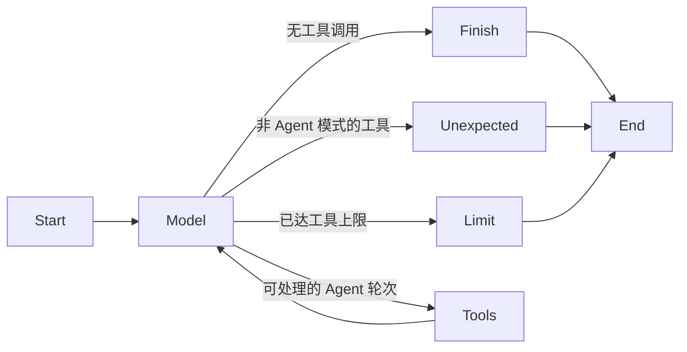

# LangGraph Agent Runtime 重构设计

> English: [LangGraph Agent Runtime Refactor](../docs/langgraph-agent-runtime-design.md)

状态：第一阶段已实施并通过验证。

## 目标

把多轮 Agent 状态机从 `ChatGateway` 中抽离到小型 LangGraph Runtime，同时保留 AgentBox 现有的 provider 协议、流事件契约、工具安全策略、加密存储边界和 Electron 进程隔离。

本次重构的目的是让 `model -> tools -> model -> terminal` 生命周期变得明确且可独立测试，而不是把整个应用迁移到 LangChain 抽象。

## 范围

第一阶段只引入 `@langchain/langgraph` 和 `@langchain/core` 来承担 Agent 控制流。

范围内：

- model turn 与 tool turn 的图状态转换；
- Agent 工具轮次计数与终止；
- 把现有取消信号传入图执行；
- 覆盖正常完成、多轮工具、非 Agent 模式、轮次上限和失败路径的契约测试；
- 让 `ChatGateway` 继续输出现有 `StreamEvent` 的适配边界。

范围外：

- 替换原生 OpenAI Chat Completions API、OpenAI Responses API 或 Anthropic Messages API 适配器；
- 替换官方 MCP TypeScript SDK Client 或 `McpManager`；
- 允许 LangGraph 或 LangChain 工具绕过 AJV 校验、审批策略、工作区限制、超时或结果限制；
- 引入 LangSmith 或默认远程 tracing；
- 把图 checkpoint 保存到未加密的 SQLite 数据库；
- 修改 renderer、preload 或 IPC 契约。

## 目标边界

```text
Renderer / 已校验 IPC
            |
        ChatGateway
            |
     LangGraph Runtime
       /          \
model-turn hook  tool-turn hook
       |              |
原生协议      现有校验、
适配器 + SSE   审批和执行器
       \              /
        现有 StreamEvent emitter
```

`ChatGateway` 继续作为请求级组装根。它负责 provider/model 解析、代理调度、网络停滞监控、错误脱敏、工具审批等待，以及构建传给图的回调。

LangGraph Runtime 只管理以下转换状态：

| 状态             | 含义                                             |
| ---------------- | ------------------------------------------------ |
| `messages`       | 为下一个 model turn 准备的 provider-neutral 消息 |
| `turn`           | 当前请求中已进入的模型节点数                     |
| `toolTurns`      | 已接受工具处理的模型轮次数                       |
| `modelResult`    | 最新 provider 流的归一化结果                     |
| `terminal`       | 终态处理器是否已完成                             |
| `terminalReason` | 正常、非预期工具调用或工具上限终止路由           |

图拓扑如下：



## 兼容性要求

1. 进入 provider 请求前递增 model turn，保持流式工具与 reasoning 事件中现有的 `turn` 值。
2. 同一个 provider 响应包含一个或多个工具调用时，只消耗一个 Agent tool turn。
3. 工具继续按 provider 返回顺序串行执行，以保持审批顺序且不改变副作用行为。
4. 达到配置上限时，为每个未执行调用发送错误结果，并以 `tool_turn_limit` 终止。
5. 非 Agent 模式下的工具调用以 `unexpected_tool_call` 终止，且绝不执行。
6. provider 流已发出终态事件时，不再发送重复 `done`。
7. 120 秒网络停滞监控只在等待 provider 数据时运行，工具审批和执行期间保持暂停。
8. 取消继续通过同一个请求级 `AbortSignal` 终止 provider、MCP、终端、代码、工作区、审批和图执行。
9. Provider trace item、Anthropic thinking signature、工具执行、动态加载 Skill 和上下文裁剪保持现有 wire/persistence 形状。

## Checkpoint 策略

第一阶段明确不启用 LangGraph persistence。AgentBox 当前把会话、凭据、设置、Skills 和 MCP 配置加密保存在 Vault 中。直接使用标准 SQLite checkpointer 会形成第二份包含 prompt、工具参数和结果的明文存储。

后续持久化阶段必须在 AgentBox 加密仓库上实现兼容 `BaseCheckpointSaver` 的适配器，定义 checkpoint 配额和删除行为，并迁移或协调现有 `agentTrace` 中断格式。在此之前，现有加密会话 checkpoint 仍是权威状态。

## 依赖与打包约束

- 在 `package.json` 和 `pnpm-lock.yaml` 中锁定兼容的 `@langchain/langgraph` 与 `@langchain/core` 版本。
- Electron main 输出继续使用 `out/main/index.cjs`。
- 如果外置 CommonJS 在 `app.asar` 内解析不稳定，优先把 LangGraph Runtime 打包进主进程输出。
- 完成前运行完整质量门、生产构建、未打包目录构建和未打包应用启动冒烟测试。

## 验证计划

聚焦 Runtime 的测试覆盖：

- 无工具的直接完成；
- 多个 model/tool 循环；
- 多个工具调用只消耗一个 tool turn；
- 配置的 tool-turn 上限；
- 非 Agent 模式下的非预期工具调用；
- 回调失败和取消传播。

现有 Gateway 和协议测试继续作为请求体、SSE 归一化、工具审批、执行结果、Skills、上下文回放和终态事件的行为契约。
