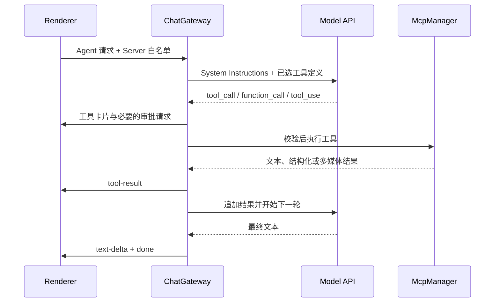

# 5. MCP 外部工具协议与智能检索

> [English documentation](../docs/mcp-integration.md)

Model Context Protocol（MCP）是开放的工具集成协议。AgentBox 使用官方 TypeScript SDK 管理 MCP Client 生命周期，并在 Gateway 中完成服务器白名单、工具检索、参数校验、用户审批和多轮执行。

---

## 传输与连接生命周期

```text
+--------------------------------------------------------------------+
|                         ChatGateway                                |
|          Tool selection / approval / multi-turn execution          |
+--------------------------------------------------------------------+
                                  |
                                  v
+--------------------------------------------------------------------+
|                         McpManager                                 |
|          Client pool / paginated listing / aggregation             |
+--------------------------------------------------------------------+
                   |                                  |
                   v                                  v
+------------------------------------+  +----------------------------+
| Official StdioClientTransport      |  | Remote HTTP transports     |
| child process + JSON-RPC            |  | Streamable HTTP / 旧式 HTTP+SSE|
+------------------------------------+  +----------------------------+
```

配置值与实际行为如下：

| 配置值  | SDK Transport                   | 行为                                                              |
| ------- | ------------------------------- | ----------------------------------------------------------------- |
| `stdio` | `StdioClientTransport`          | 启动本地命令，通过 stdin/stdout 交换 JSON-RPC。                   |
| `http`  | `StreamableHTTPClientTransport` | 优先使用当前的 Streamable HTTP；连接失败时自动尝试旧式 HTTP+SSE。 |
| `sse`   | `SSEClientTransport`            | 显式使用旧式 HTTP+SSE，不先尝试 Streamable HTTP。                 |

- Stdio 子进程使用 SDK 的默认安全环境变量集合，再叠加该 MCP Server 的自定义环境变量；单条缓冲消息上限为 10 MiB。
- Streamable HTTP 配置了有限重连（初始 500 ms、最大 10 s、最多 3 次），会话 ID、协议版本头和 SSE 数据流由 SDK 处理。
- HTTP 远程地址必须使用 HTTPS；仅本机回环地址允许 HTTP。保存时会移除 URL 中的用户信息、查询参数和 fragment，认证信息应放入自定义请求头。每个远程 MCP 请求都使用 `redirect: "error"`；遇到重定向会直接拒绝，而不会跟随到未经校验的目标。
- Stdio 环境变量和远程请求头保存在加密 Vault 中；返回 Renderer 的配置只包含同名遮罩值。请求头会拒绝 `Host`、`Content-Length`、Cookie 和代理认证等受控字段。
- 远程 MCP 请求遵循应用的自定义网络代理设置。
- [`McpManager`](../src/electron/mcp/mcp-manager.ts) 复用配置未变化的 Client，并以最高 8 个 Server 的并发度聚合工具。工具列表每页 30 秒超时，每个 Server 最多读取 64 页、2,000 个工具；收到工具列表变更通知时当前实现记录日志，下一次列举会重新获取列表。

连接实现见 [`src/electron/mcp/mcp-client.ts`](../src/electron/mcp/mcp-client.ts)。

---

## BM25 工具检索与会话白名单

[`src/electron/mcp/tool-retriever.ts`](../src/electron/mcp/tool-retriever.ts) 会把工具名、Server 名称、描述、参数名和参数描述组成检索文档，并对中英文词项进行 BM25 评分：

- **智能检索（`auto`）**：Gateway 使用当前最后一条用户消息作为查询，注入分数达到 0.75 的前 8 个 MCP 工具；工具全名和名称片段命中会获得额外权重。没有合格结果时不会任意补齐。
- **全部挂载（`all`）**：注入会话允许的全部 MCP 工具，不做相关度过滤。
- 动态 Agent 工具挂载关闭时（兼容性默认），上述检索只作用于外部 MCP 工具。`agentbox_load_skill`、代码运行器、工作区文件工具和集成终端等内置 Agent 工具会按可用条件追加，不参与 BM25 排名。
- 动态挂载开启时，同一排名会作用于本次请求已授权的完整内置/MCP 联合目录，初始上限默认为 4 个工具。始终挂载的只读后备工具 `agentbox_search_tools` 仅搜索该已授权目录，并在下一模型轮次挂载匹配项；它不会执行匹配工具。模型调用开始时会快照当前工具集，因此搜索调用不能授权同一模型响应中的第二个调用。

每个会话通过 `mcpServerIds` 建立 Server 白名单：

- 字段未设置时，可聚合所有全局启用的 MCP Server。
- 空数组表示不允许任何 MCP Server。
- 非空数组只允许其中仍处于全局启用状态的 Server；失效或停用的 ID 不会产生工具。

为了避免名称碰撞和伪造调用，模型看到的是带 Server/工具哈希的 64 字符以内安全别名。执行器只接受本轮确实暴露过的别名，再路由回原始 Server ID 与工具名。

---

## Agent 多轮执行循环



- Gateway 在 OpenAI Chat Completions API 的 `tool_calls`、OpenAI Responses API 的 `function_call` 与 Anthropic Messages API 的 `tool_use` 之间桥接协议格式。
- 请求级 LangGraph Runtime 控制 model/tool/终态转换；参数校验、审批、执行、事件发送与 provider 历史构造仍位于 Gateway 回调中。
- Agent 工具执行上限默认 30 轮，可在设置中调整为 1–100；达到上限后，本轮尚未执行的调用会收到错误结果。
- `agentTrace` 是按发生顺序保存的协议无关账本，包含 Assistant 文本、Anthropic 带签名的 thinking block、已完成的 Responses reasoning item、工具调用、工具结果及必要的 provider item。通用可见的 Chat/Responses reasoning 仍位于 `Message.reasoning`，不一定是协议重放状态；该账本可用于后续协议重放。
- 带 renderer response ID 的 Agent 请求还会写入加密 LangGraph checkpoint thread。只有 provider-node 失败会直接恢复该 thread；取消和副作用不确定的工具路径使用 `agentTrace` 中的已完成/错误结果重启，避免重复写入或执行。
- 限流、网络/API 错误、输出上限（包括 OpenAI Responses 的 `max_output_tokens`）、工具轮次上限或用户停止会生成 `interruption` 检查点。恢复时复用已完成结果；对结果未知且可能有副作用的操作，应先检查外部状态再决定是否重试。
- 只有当前分支最后一条 Assistant 消息存在检查点时，`go`、`continue`、`resume`、`retry`、`继续` 等短指令才会作为恢复请求；附件或新的实质要求仍按新问题处理。

---

## 审批策略与执行边界

所有工具调用都先解析 JSON，并通过工具的 input JSON Schema 校验。非法 JSON、Schema 不匹配、未知工具以及本轮未暴露的工具都不会执行。

### 审批模式

| 设置                              | 实际行为                                                                                                                                                      |
| --------------------------------- | ------------------------------------------------------------------------------------------------------------------------------------------------------------- |
| **智能确认（`sensitive`，默认）** | 只有同时声明 `readOnlyHint: true`、`destructiveHint: false`、`openWorldHint: false` 的工具可自动执行；其余工具需要审批。                                      |
| **每次确认（`always`）**          | 所有代码、终端、工作区和 MCP 调用都需要审批。本地目录/结果/Skill 资源读取器不产生副作用，因此无需审批。                                                       |
| **Full Access（`full-access`）**  | 跳过代码、终端、工作区文件、外部 MCP 和内置浏览器操作的审批，包括页面共享、交互、上传和下载。它不会放宽硬性 URL、路径、Schema、超时、敏感字段或结果大小校验。 |

内置工具还有以下固定规则：

- `agentbox_load_skill` 只加载已启用技能的本地文档，不执行脚本，因此直接完成且不弹出审批。
- `agentbox_search_tools`、`agentbox_read_tool_result` 和 `agentbox_read_skill_resource` 只检查本次请求已授权的内存或本地数据。它们绝不执行搜索到的工具或 Skill 脚本，也不会弹出审批。
- `agentbox_run_code` 和 `agentbox_run_terminal` 始终按敏感操作处理；除 Full Access 外都需要用户批准。
- `agentbox_read_file` 带有完整的只读、非破坏、封闭环境声明，因此在默认策略下可自动执行；`agentbox_write_file` 是破坏性写入，需要审批。
- 可选的 `agentbox_browser_*` 工具族只有在应用级浏览器开关和对话级“浏览器工具”开关同时启用时才会暴露。`agentbox_browser_tabs` 会列出稳定 tab ID，并新建、激活或关闭标签页。默认策略下，新来源导航在没有内存来源读取授权时需要审批；导航审批可以为该来源授予读取能力，因此快照、截图和滚动不一定再出现独立的首次读取提示。来源授权绝不会授权点击、输入、上传或下载。点击和文本输入始终属于敏感操作。即使启用 Full Access，密码、隐藏、文件字段，以及通过受支持的 password、`one-time-code` 或 `cc-*` autocomplete 元数据识别出的字段仍会被硬性拒绝。截图、上传和下载工具只有在各自独立设置开启时才会出现；Agent 上传和下载均限制在对话工作目录内。
- 外部 MCP Server 的 `ToolAnnotations` 是 Server 自行声明的数据；缺少任意一项完整低风险声明时，默认按敏感工具处理。

审批默认等待 5 分钟，也可设置为永不超时。等待审批时，120 秒网络停滞计时器会暂停；用户拒绝、停止请求或请求生命周期结束都会终止等待。Full Access 只适用于完全可信的模型、MCP Server、网站和任务。

### 隔离式多标签浏览器

浏览器是 AgentBox 内部工具服务，而不是 MCP Server 进程；但它会复用 `McpToolDefinition`、三协议适配器、JSON Schema 校验、工具卡片、审批等待、`toolExecutions` 和 `agentTrace`。每个结果都会标明 `tab_id`。`agentbox_browser_navigate` 只打开经过策略检查的 URL，不返回页面内容；`agentbox_browser_snapshot` 返回带“不可信”标记的有界可见文本和短期元素引用。点击、输入、上传、下载和滚动只能使用同一标签页最新快照中的引用；导航或交互后引用立即失效。截图工具返回经过大小限制的 JPEG。Responses 与 Anthropic 会在工具结果内回放图像；Chat Completions 的[官方 tool message Schema](https://developers.openai.com/api/reference/resources/chat/subresources/completions/methods/create)只接受文本，因此客户端会先结束文本工具结果，再追加带明确“不可信工具图像”标签的 user image 输入。

每个驻留的对话浏览器使用一个由全部标签页共享的非持久 Electron session。AgentBox 最多保留三个活动 session；创建第四个前会回收最久未使用的隐藏 session，其标签、历史、DOM 状态和站点存储随之丢失。弹窗会转换成经过策略检查的标签页；Web 权限、嵌入式凭据、不支持的协议、`.local` 名称、字面量私网地址或 DNS 解析为私网的目标，以及已识别敏感表单字段仍会被阻止。公开 HTTPS 是默认规则；只有显式启用设置后，本地开发环回地址才可使用明文 HTTP。相同的私网策略也覆盖 subresource，`data:` 与 `blob:` 仅允许作为 subresource。启用 Cookie 持久化时，客户端会把 Chromium 接受的 Cookie 快照写入按对话隔离的加密 Vault profile，并在新的内存 session 中恢复；缓存、站点存储、DOM 状态、标签历史、元素引用和来源授权始终不持久化。手动下载进入系统“下载”目录，Agent 下载等待完成后创建不覆盖已有文件的工作区相对文件；所有浏览器下载都受 100 MiB 上限约束。启用浏览器上传也会允许用户操作普通系统文件选择器，其选择不受工作区范围限制；独立的 Agent 上传工具最多接受十个普通且非符号链接的工作区文件，单文件 25 MiB、总计 100 MiB。

### 资源与数据边界

- 浏览器 URL 最长 4,096 个字符。导航默认 20 秒，可设置为 3–30 秒。序列化快照最多保留 100,000 个字符和前 500 个交互引用；单次返回片段默认 16,000 字符，可设置为 2,000–32,000。截图默认最大边 1,280 像素，可设置为 512–1,600；生成的 JPEG Base64 payload 最多 2,097,152 个字符。
- MCP `callTool` 超时为 60 秒并接受请求取消信号。
- MCP 最多保留 100 个 rich-content 条目。文本与结构化内容共享 100,000 字符的总预算；扁平结果同样限制在约 100,000 字符。每个图片、音频或二进制 Resource 的 Base64 数据最多 2 MiB，全部保留的二进制 payload 还共享 2 MiB 总预算；超限内容会省略或标记截断。
- `agentbox_read_file` / `agentbox_write_file` 拒绝绝对路径、`..`、UNC 路径和工作目录内的符号链接。读取仅接受 2 MiB 以内的 UTF-8 普通文件；单次写入同时受 100,000 字符和 512 KiB 限制。
- 工具描述、参数、返回内容和外部 Resource 都按不可信数据处理；它们不能覆盖更高优先级指令。
- 集成终端只有初始 `cwd`，不是操作系统沙箱。获批命令仍可能使用绝对路径、访问工作目录外文件、启动进程或联网，详见[会话工作目录与开发运行时](workspaces-and-runtimes.md)。

---

## UI 与诊断

1. **设置 → MCP 外部工具**：创建、启停和测试 stdio、Streamable HTTP 或旧式 HTTP+SSE 配置；测试结果会显示实际协商成功的 Transport、协议版本和工具数量。
2. **Tool Explorer**：汇总已启用的 MCP 工具和 AgentBox 内置工具，可按来源筛选并查看 input Schema。工作区文件工具会出现在目录中，但只在具有工作目录的 Agent 会话中实际挂载。
3. **Composer 白名单**：选择当前会话允许的 MCP Server。
4. **工具卡片**：显示等待审批、执行中、完成、拒绝或错误状态，以及参数和截断后的结果。
5. **中断恢复**：可以从检查点继续，也可以从原用户问题重新生成；两者的副作用语义不同。

## data-plat

数据平台服务器可启用精确执行确认、逐操作 OBO 凭据和保守历史恢复。2020-12 使用 Ajv2020；无声明/draft-07 保持兼容，未知方言拒绝。详见 [data-plat 集成](data-plat-integration.md)。
